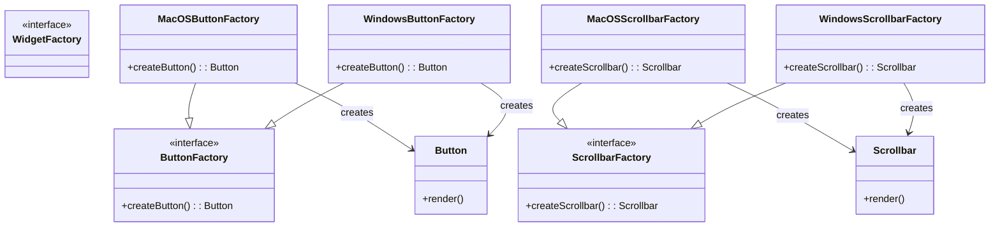

Act as an expert user of the Gang of Four Design Patterns.  You are crazy about enforcing the Single Responsibility Principle.  Do you think that we could abstract out this widget factory example any more?

# The widget example

# Theres more!

Act as an expert user of the Gang of Four Design Patterns.  You are crazy about enforcing the Single Responsibility Principle.  Do you think that we could abstract out this widget factory example any more?

# The widget example

# Another one even more abstract?

