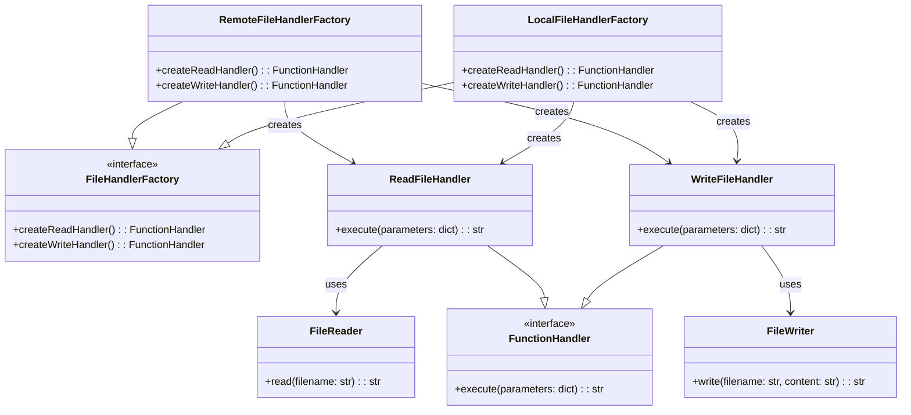
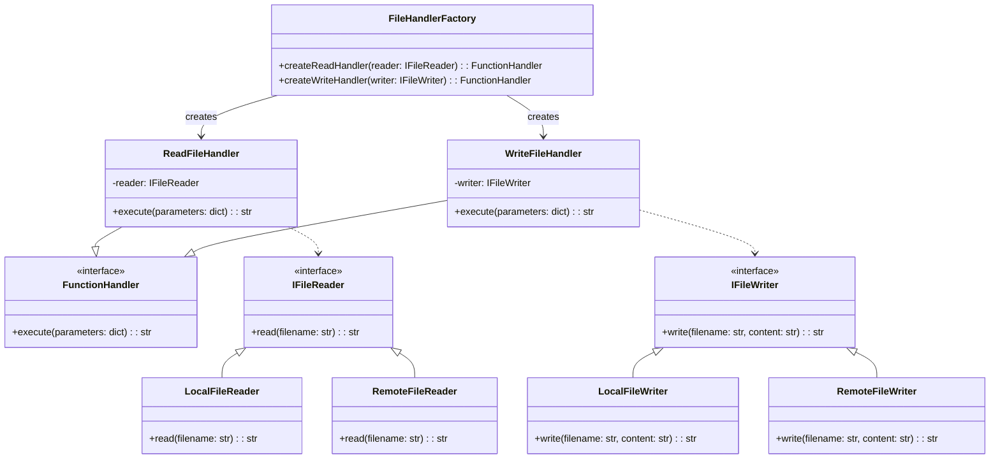
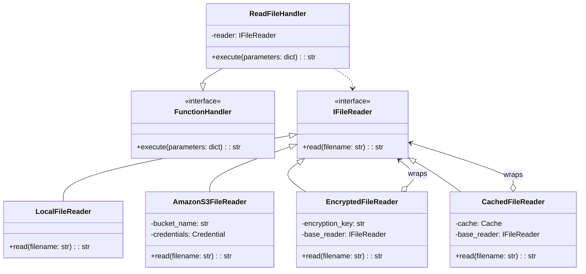
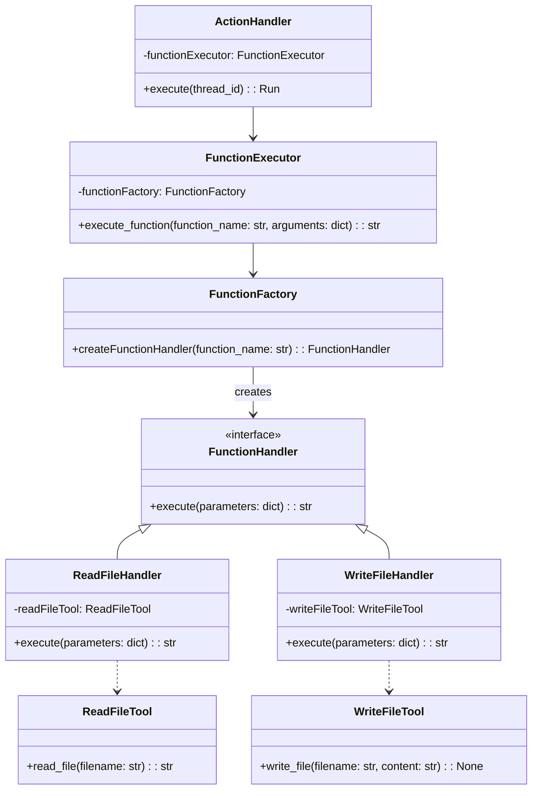
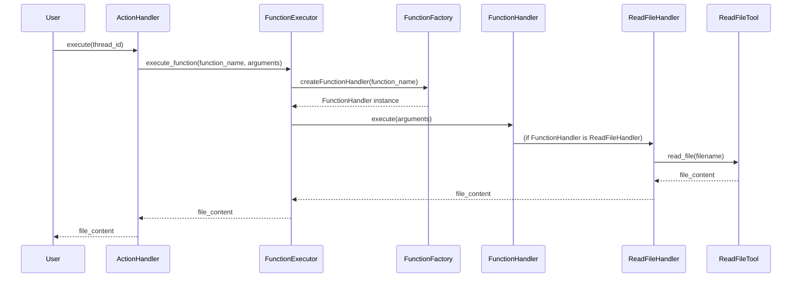
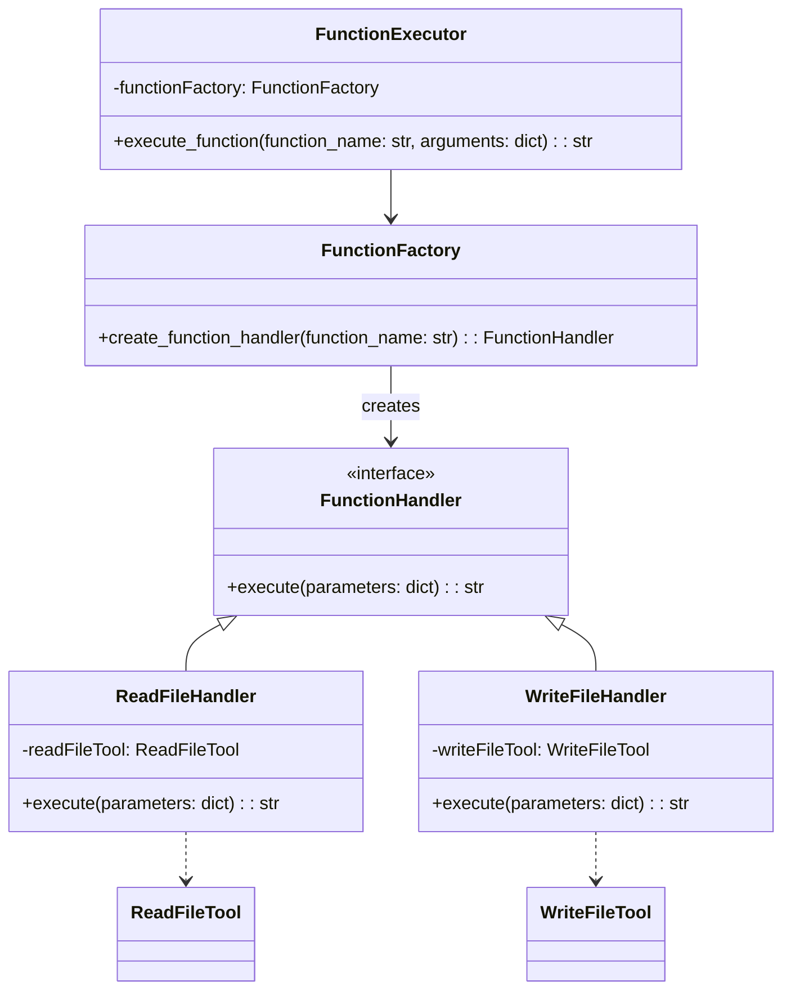

# Persona
- World-class Python Developer
- Expert user of the Gang of Four Design Patterns.  
- You are crazy about enforcing the Single Responsibility Principle and Open-Closed Principles of software design.  

# Your task
Think about how we could modify the Python code that I have so that it will work with the system that it works in right now and work in the system depicted in the following Mermaid Sequece Diagrams.  Use your wisdom from many years of using  GoF design patterns. Remember the hours that using those GoF patterns have helped you make more flexible, testable, extendable, and maintainable software.

# Main Mermaid Sequence Diagram for the File Handling System that we are building.


# Mermaid diagram for the File Handling system.



# Example ReadFileHandler with more reader types



#  Existing code that I don't want to modify.  Instead we may need to extend the classes in the following existing Python code.
## ReadFileTool
```python
class ReadFileTool:
    """
    Provides a tool for reading the contents of a file.
    
    The `ReadFileTool` class exposes a `read_file` function that can be used to read the contents of a file. The function takes a `filename` parameter that specifies the name of the file to read.
    
    The `schema` method returns a JSON schema that describes the `read_file` function, including its parameters and return value.
    """
    
    def __init__( self ):
        print ( "initialaizing" )

    def schema(): 
        return {
                "type": "function",
                "function": {
                    "name": "read_file",
                    "description": "Read the contents of a file",
                    "parameters": {
                        "type": "object",
                        "properties": {
                            "filename": {
                                "type": "string",
                                "description": "The name of the file to read."
                            }
                        },
                        "required": ["filename"]
                    }
                }
            }

    def read_file( filename ):
        """Reads content from a specified file.
        
        Args:
            filename (str): The name of the file to read from.
        
        Returns:
            str: The content of the file.
        """
        # morph the file name since the assistant seems to be looking at it's sandbox
        filename = filename.replace( '/mnt/data/', '' )
        with open( filename, 'r' ) as file:
            return file.read()
```

## StringToFunction
```python
#
#  creates a live function from a string
#
class StringToFunction:
    def __init__( self, function_map_arg ):
        '''
        Initialize the StringToFunction object with a dictionary of available functions.
        
        Args:
            function_map_arg (dict): A dictionary mapping function names to their implementations.
        '''
        self.function_map = function_map_arg

    def create_function_from_string( self, function_name ):
        '''
        Create a function from a string.

        Args:
            function_string (str): The string representation of the function.

        Returns:
            function: The function object.
        '''
        if ( self.function_map.get_length() == 0 ):
            print( "*** Error: No functions initialized in the StringToFunction Object. ***" )
            return None
        
        function_maps = self.function_map.get_all_entries()
        if function_name in function_maps:
            return self.function_map.get_function( function_name )
        else:
            return None
```

## ActionHandler
```python
import string_to_function.string_to_function as StringToFunction # for func exec
from function_executor.FunctionExecutor import FunctionExecutor
import func_map_init.file_system_mapped_functions as FileSystemMappedFunctions
from JsonArgumentParser     import JSONArgumentParser
from OAIFunctionCallClient  import OAIFunctionCallClient

class ActionHandler:
    def __init__(self, messages, run):
        self.messages = messages
        self.run = run
        fs_mapped_funcs = FileSystemMappedFunctions.FileSystemMappedFunctions()
        function_map = fs_mapped_funcs.get_function_map()  # populate for file system tools
        string_to_function = StringToFunction.StringToFunction(function_map)
        self.function_executor = FunctionExecutor(string_to_function)
        self.api_client = OAIFunctionCallClient()

    def execute(self, thread_id):
        tool_calls = self.run.required_action.submit_tool_outputs.tool_calls
        tools_outputs_array = []
        if tool_calls:
            for tool_call in tool_calls:  # for each tool call in tool calls
                function_name = tool_call.function.name  # get the function name & arguments
                arguments = JSONArgumentParser.parse_arguments(tool_call.function.arguments)
                output = self.function_executor.execute_function(function_name, arguments)
                tool_output = {"tool_call_id": tool_call.id, "output": output}
                tools_outputs_array.append(tool_output)  # now continue until all tool calls completed

            self.run = self.api_client.return_output_to_caller(  # submit the output to the API
                thread_id=thread_id,
                run_id=self.run.id,
                tools_outputs_array=tools_outputs_array  # Corrected argument name
            )

        return self.run  # return the run so that we can monitor its completion status
```

## FunctionExecutor
```python
#
# FunctionExecutor class
#
# since the function executor needs to create a function from a string,
# it needs to be instantiated with it's main partner.  I'm not sure how 
# this code would work without creating a function from a string.
#
class FunctionExecutor:
    def __init__(self, string_to_function_arg):
        self.string_to_function = string_to_function_arg

    def execute_function(self, function_name, arguments):
        '''
        Execute a function referenced by its name with provided arguments.
        
        Args:
            function_name (str): The name of the function to execute.
            arguments (dict): The arguments to pass to the function as keyword arguments.
        
        Returns:
            str: The result of the function execution or a message if the function is not recognized.
        '''
        
        function_to_run = self.string_to_function.create_function_from_string(function_name)
        if function_to_run is not None:
            if isinstance(function_to_run, type):
                # If it's a class, instantiate it and call the method
                instance = function_to_run()
                method_name = function_name.split('.')[-1]
                method = getattr(instance, method_name)
                return method(**arguments)
            elif callable(function_to_run):
                # If it's a function or static method, call it directly
                return function_to_run(**arguments)
            else:
                # If it's an instance method already bound to an instance
                return function_to_run(**arguments)
        else:
            return 'Function not recognized.'
```

## FileSystemMappedFunctions
```python
class FileSystemMappedFunctions:
    def __init__(self):
        self.function_map = FunctionMap()
        print("initializing file system mapped functions...")
        storage_handler = StorageHandler("todo_list.json")
        
        # Create instances of the tools
        write_file_tool = WriteFileTool()
        read_file_tool = ReadFileTool()
        make_directory_tool = MakeDirectoryTool()
        change_directory_tool = ChangeDirectoryTool()
        get_current_directory_tool = GetCurrentDirectoryTool()
        linux_command_tool = LinuxCommandTool()
        add_todo_tool = AddTodoTool( storage_handler )
        remove_todo_tool = RemoveTodoTool( "todo_list.json", storage_handler )
        read_todo_tool = ReadTodoTool()

        # Add bound methods to the function map
        self.function_map.add_function( "write_file", write_file_tool.write_file )
        self.function_map.add_function( "read_file", read_file_tool.read_file )
        self.function_map.add_function( "make_directory", make_directory_tool.make_directory )
        self.function_map.add_function( "change_directory", change_directory_tool.change_directory )
        self.function_map.add_function( "get_current_directory", get_current_directory_tool.get_current_directory )
        self.function_map.add_function( "execute_command", linux_command_tool.execute_command )
        self.function_map.add_function( "add_todo", add_todo_tool.add_todo )
        self.function_map.add_function( "remove_todo", remove_todo_tool.remove_todo )

        self.function_map.add_function( "read_todo_list", read_todo_tool.read_todo_list )
    def get_function_map(self):
        return self.function_map
```

Remember, are designing a file handling system.  I'm wondering how we could fit this existing code into the system depicted in the Mermaid diagrams without modifying existing code, only maybe extending it.  If it is not extendable as it is, please use your infinite knowlege of GoF patterns to re-architect the code to make it extensible.  Just concentrate on the new Mermaid diagram. DO NOT WRITE ANY CODE YET.  JUST MAKE THE NEW MERMAID SEQUENCE DIAGRAM.  We can start writing the code after I review it with my team of GoF experts.

# Mermaid Class Diagram of the System


# Mermaid Sequence Diagram of the System


# Start making factories


## cheris_fifty_fifth_link_to_chatgpt_share_link
https://chatgpt.com/share/66f1ee09-02a0-8006-9f09-1ad9f5dbc953
