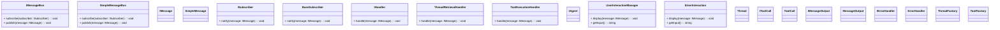

```mermaid
classDiagram
    class IMessageBus {
        + subscribe(subscriber: ISubscriber): void
        + publish(message: IMessage): void
    }

    class SimpleMessageBus {
        + subscribe(subscriber: ISubscriber): void
        + publish(message: IMessage): void
    }

    class IMessage
    class SimpleMessage

    class ISubscriber {
        + notify(message: IMessage): void
    }

    class BaseSubscriber {
        + notify(message: IMessage): void
    }

    class IHandler {
        + handle(message: IMessage): void
    }

    class ThreadRetrievalHandler {
        + handle(message: IMessage): void
    }

    class ToolExecutionHandler {
        + handle(message: IMessage): void
    }

    class IAgent
    class UserInteractionManager {
        + display(message: IMessage): void
        + getInput(): string
    }

    class IUserInteraction {
        + display(message: IMessage): void
        + getInput(): string
    }

    class Thread
    class IToolCall
    class ToolCall
    class IMessageOutput
    class MessageOutput
    class IErrorHandler
    class ErrorHandler
    class ThreadFactory
    class ToolFactory
```