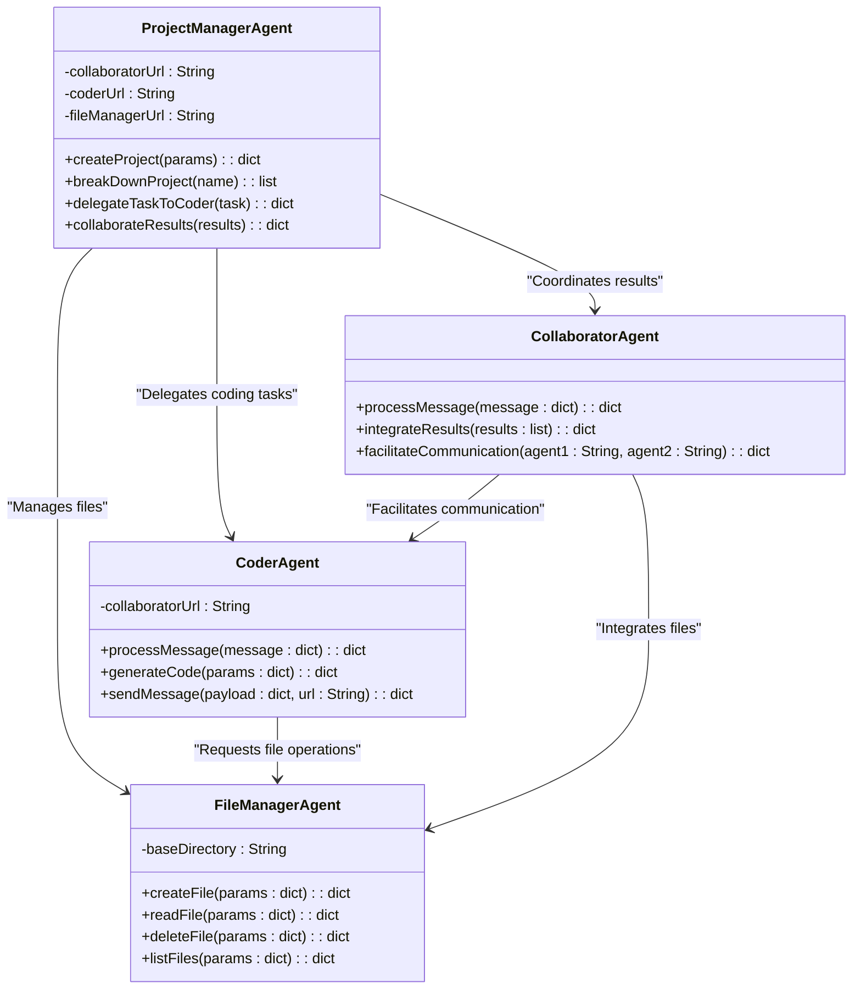

Please summarize what we have talked about so far.   Create a markdown document in one CODE BLOCK that I can copy and paste into vscode and show my design team our plans.  Use simple mermaid and class diagrams to help us visualize our design.  Remember that we want a coder, planner, collaborator and human on this team so far.  So far the goal is to have a communication system that will help us perform software development tasks.  Sprinkle some analogies into the discussion to help us understand the concepts.  We are going to expand on this design, so keep that in mind as you create the document.

# Software Development Multi-Agent System Design

## Overview

We are designing a **Multi-Agent Communication System** for software development tasks. The goal is to have a team of agents, including humans, collaborating to efficiently break down and execute complex software projects. Think of it as a **highly organized digital assembly line**, where each agent has a specialized role, ensuring a seamless workflow.

---

## Key Roles in the System

### 1. **ProjectManagerAgent**
   - **Role**: Acts as the team leader. Breaks down high-level project requirements into actionable tasks and delegates them to appropriate agents.
   - **Analogy**: The director of a movie, ensuring all actors and crew members perform their roles effectively.

### 2. **CoderAgent**
   - **Role**: Writes and generates code based on tasks assigned by the `ProjectManagerAgent`.
   - **Analogy**: The craftsman who builds the tools and machinery for the project.

### 3. **CollaboratorAgent**
   - **Role**: Facilitates communication between agents, integrates their outputs, and ensures smooth collaboration.
   - **Analogy**: A diplomat who ensures everyone on the team understands each other and works harmoniously.

### 4. **FileManagerAgent**
   - **Role**: Handles file and directory operations, such as creating, reading, and managing project files.
   - **Analogy**: The librarian who organizes and keeps track of all the books and resources.

### 5. **Human**
   - **Role**: Oversees the system, provides high-level input, and reviews the final output.
   - **Analogy**: The client or supervisor who evaluates the team's work.

---

## System Design Diagram

---

## Workflow

1. **Project Initialization**:
   - A human provides a high-level requirement, such as "Build a tennis game."
   - The `ProjectManagerAgent` breaks this into tasks:
     - Implement game logic.
     - Create scoring system.
     - Design the user interface.

2. **Task Delegation**:
   - The `ProjectManagerAgent` assigns coding tasks to the `CoderAgent`.
   - The `CollaboratorAgent` oversees communication between agents and tracks progress.

3. **Code Writing**:
   - The `CoderAgent` generates code and saves it using the `FileManagerAgent`.

4. **Integration**:
   - The `CollaboratorAgent` combines and tests the outputs to ensure they work together.

5. **Finalization**:
   - The `ProjectManagerAgent` reviews the integrated output and provides it to the human for approval.

---

## Road Map

### Phase 1: Initial Implementation
1. **Set up communication** between agents using the Model Context Protocol (MCP).
2. Implement the **FileManagerAgent** to handle basic file operations.
3. Build the **CoderAgent** to generate code and interact with the `FileManagerAgent`.

### Phase 2: Collaboration and Delegation
4. Implement the **CollaboratorAgent** to manage communication between agents.
5. Develop the **ProjectManagerAgent** to break down projects and assign tasks.

### Phase 3: System Integration and Testing
6. Create end-to-end workflows to test the system on sample projects.
7. Allow human users to interact with the system via a user interface.

### Phase 4: Advanced Features
8. Add version control capabilities to the `FileManagerAgent`.
9. Introduce machine learning models for task optimization in the `ProjectManagerAgent`.
10. Enable real-time collaboration between human users and agents.

---

## Summary

This system is designed to mimic a **collaborative software development team**. Each agent plays a specific role, just like members of a real-world team, ensuring efficiency and modularity. By starting small and iteratively building out the system, we’ll create a flexible and scalable solution for tackling software development tasks.
