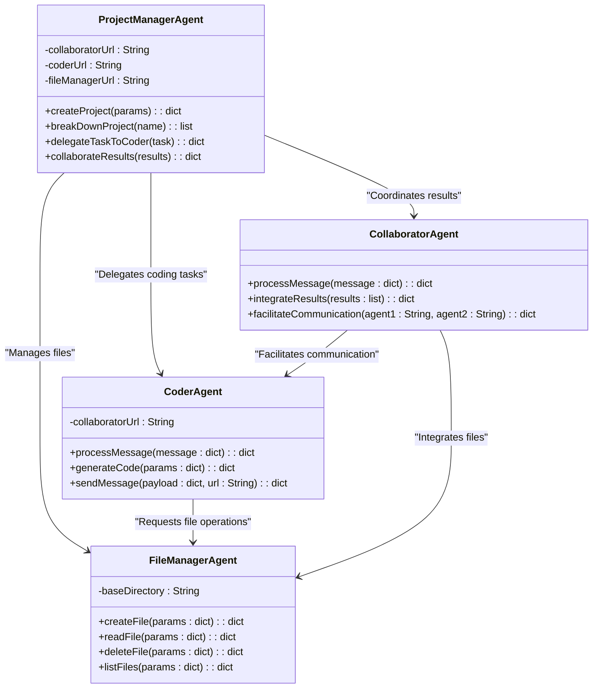

Please summarize what we have talked about so far.   Create a markdown downloadable document that I can paste into vscode and show my design team and my stakeholders our plans. Remember that we want a coder, planner, collaborator and human on this team so far.  The goal is to have a communication system that will help us perform software development tasks.  We are going to expand on this design, so keep that in mind as you create the document.  We have not started any coding yet aside from the examples that I have pasted in.  I am going to use this document as a guide for this Agent communication network.


# Software Development Multi-Agent System Design Plan

## Overview

We are designing a **Multi-Agent Communication System** for software development tasks. The goal is to have a team of agents, including humans, collaborating to efficiently break down and execute complex software projects.

---

## Key Roles in the System

### 1. **ProjectManagerAgent**
   - **Role**: Acts as the team leader. Breaks down high-level project requirements into actionable tasks and delegates them to the appropriate agents.
   - **Responsibilities**:
     - Receive high-level project requirements.
     - Break down the project into smaller, actionable tasks.
     - Assign tasks to other agents.
     - Monitor progress and ensure the integration of all components.

### 2. **CoderAgent**
   - **Role**: Writes and generates code based on tasks assigned by the `ProjectManagerAgent`.
   - **Responsibilities**:
     - Receive tasks from the `ProjectManagerAgent`.
     - Generate modular, testable code for specific tasks.
     - Interact with the `FileManagerAgent` to save and retrieve files.

### 3. **CollaboratorAgent**
   - **Role**: Facilitates communication between agents, integrates their outputs, and ensures smooth collaboration.
   - **Responsibilities**:
     - Handle communication between agents.
     - Track progress of tasks.
     - Integrate outputs into a cohesive final product.

### 4. **FileManagerAgent**
   - **Role**: Handles file and directory operations, such as creating, reading, and managing project files.
   - **Responsibilities**:
     - Manage files and directories for the project.
     - Support file creation, reading, deletion, and listing.
     - Ensure that files are accessible to other agents.

### 5. **Human**
   - **Role**: Oversees the system, provides high-level input, and reviews the final output.
   - **Responsibilities**:
     - Provide initial project requirements.
     - Monitor the system's performance and outputs.
     - Validate the final deliverables.

---

## System Design Diagram



---

## Workflow Steps

1. **Project Initialization**:
   - A human provides a high-level requirement, such as "Build a tennis game."
   - The `ProjectManagerAgent` breaks this into tasks.  In the example of a tennis game, the tasks might include for example:
     - Implement game logic.
     - Create scoring system.
     - Design the user interface.

2. **Task Delegation**:
   - The `ProjectManagerAgent` assigns coding tasks to the `CoderAgent`.
   - The `CollaboratorAgent` oversees communication between agents and tracks progress.

3. **Code Writing**:
   - The `CoderAgent` generates code and saves it using the `FileManagerAgent`.

4. **Integration**:
   - The `CollaboratorAgent` combines and tests the outputs to ensure they work together.

5. **Finalization**:
   - The `ProjectManagerAgent` reviews the integrated output and provides it to the human for approval.

---

## Road Map

### Phase 1: Initial Implementation
1. Create the Chat Client and talk to the file system mcp.  Set up communication between the chat client and the File Manager using the Model Context Protocol (MCP).
2. Implement the `FileManagerAgent` to handle basic file operations.
3. Start the FileManagerAgent and the Chat Client.
4. Test basic file operations using the Chat Client.

### Phase 2: Collaboration and Delegation
3. Build the `CoderAgent` to generate code and interact with the `FileManagerAgent`.
4. Implement the `CollaboratorAgent` to manage communication between agents.
5. Develop the `ProjectManagerAgent` to break down projects and assign tasks.

### Phase 3: System Integration and Testing
6. Create end-to-end workflows to test the system on sample projects.
7. Allow human users to interact with the system via a user interface.

### Phase 4: Advanced Features
8. Add version control capabilities to the `FileManagerAgent`.
9. Introduce machine learning models for task optimization in the `ProjectManagerAgent`.
10. Enable real-time collaboration between human users and agents.

---

## Plan Summary

This system is designed to mimic a **collaborative software development team**. Each agent plays a specific role to ensure efficiency and modularity. By starting small and iteratively building out the system, we’ll create a flexible and scalable solution for tackling software development tasks.


# What we have to work with so far
## Source code for the Human Input
```python
import asyncio
from typing import Optional
from contextlib import AsyncExitStack

from mcp import ClientSession, StdioServerParameters
from mcp.client.stdio import stdio_client

from anthropic import Anthropic
from dotenv import load_dotenv

load_dotenv()  # load environment variables from .env

class MCPClient:
    def __init__(self):
        # Initialize session and client objects
        self.session: Optional[ClientSession] = None
        self.exit_stack = AsyncExitStack()
        self.anthropic = Anthropic()

    async def connect_to_server(self, server_script_path: str):
        """Connect to an MCP server
        
        Args:
            server_script_path: Path to the server script (.py or .js)
        """
        is_python = server_script_path.endswith('.py')
        is_js = server_script_path.endswith('.js')
        if not (is_python or is_js):
            raise ValueError("Server script must be a .py or .js file")
            
        command = "python" if is_python else "node"
        server_params = StdioServerParameters(
            command=command,
            args=[server_script_path],
            env=None
        )
        
        stdio_transport = await self.exit_stack.enter_async_context(stdio_client(server_params))
        self.stdio, self.write = stdio_transport
        self.session = await self.exit_stack.enter_async_context(ClientSession(self.stdio, self.write))
        
        await self.session.initialize()
        
        # List available tools
        response = await self.session.list_tools()
        tools = response.tools
        print("\nConnected to server with tools:", [tool.name for tool in tools])

    async def process_query(self, query: str) -> str:
        """Process a query using Claude and available tools"""
        messages = [
            {
                "role": "user",
                "content": query
            }
        ]

        response = await self.session.list_tools()
        available_tools = [{ 
            "name": tool.name,
            "description": tool.description,
            "input_schema": tool.inputSchema
        } for tool in response.tools]

        # Initial Claude API call
        response = self.anthropic.messages.create(
            model="claude-3-5-sonnet-20241022",
            max_tokens=1000,
            messages=messages,
            tools=available_tools
        )

        # Process response and handle tool calls
        tool_results = []
        final_text = []

        for content in response.content:
            if content.type == 'text':
                final_text.append(content.text)
            elif content.type == 'tool_use':
                tool_name = content.name
                tool_args = content.input
                
                # Execute tool call
                result = await self.session.call_tool(tool_name, tool_args)
                tool_results.append({"call": tool_name, "result": result})
                final_text.append(f"[Calling tool {tool_name} with args {tool_args}]")

                # Continue conversation with tool results
                if hasattr(content, 'text') and content.text:
                    messages.append({
                      "role": "assistant",
                      "content": content.text
                    })
                messages.append({
                    "role": "user", 
                    "content": result.content
                })

                # Get next response from Claude
                response = self.anthropic.messages.create(
                    model="claude-3-5-sonnet-20241022",
                    max_tokens=1000,
                    messages=messages,
                )

                final_text.append(response.content[0].text)

        return "\n".join(final_text)

    async def chat_loop(self):
        """Run an interactive chat loop"""
        print("\nMCP Client Started!")
        print("Type your queries or 'quit' to exit.")
        
        while True:
            try:
                query = input("\nQuery: ").strip()
                
                if query.lower() == 'quit':
                    break
                    
                response = await self.process_query(query)
                print("\n" + response)
                    
            except Exception as e:
                print(f"\nError: {str(e)}")
    
    async def cleanup(self):
        """Clean up resources"""
        await self.exit_stack.aclose()

async def main():
    if len(sys.argv) < 2:
        print("Usage: python client.py <path_to_server_script>")
        sys.exit(1)
        
    client = MCPClient()
    try:
        await client.connect_to_server(sys.argv[1])
        await client.chat_loop()
    finally:
        await client.cleanup()

if __name__ == "__main__":
    import sys
    asyncio.run(main())
```

## Source code for the Base Agent
```python
import json
from jsonrpc import JSONRPCResponseManager, dispatcher
from xmlrpc.server import SimpleXMLRPCServer
import socket
import psutil
from abc import ABC, abstractmethod

class BaseAgentLogger:
    def __init__(self):
        pass

    def info(self, message):
        print(f"INFO: {message}")

    def error(self, message):
        print(f"*** ERROR: {message} ***")

def is_port_in_use(port):
    with socket.socket(socket.AF_INET, socket.SOCK_STREAM) as s:
        return s.connect_ex(('localhost', port)) == 0

def kill_process_on_port(port):
    for proc in psutil.process_iter(['pid', 'name']):
        try:
            for conn in proc.connections(kind='inet'):
                if conn.laddr.port == port:
                    print(f"Killing process {proc.info['name']} (PID: {proc.info['pid']}) on port {port}")
                    proc.kill()
        except psutil.AccessDenied:
            print(f"Access denied when attempting to kill process on port {port}")
        except psutil.NoSuchProcess:
            print(f"Process on port {port} no longer exists")

class BaseAgent(ABC):
    def __init__(self, agent_id: str, server_port: int):
        self.agent_id = agent_id
        self.server_port = server_port
        self.logger = BaseAgentLogger()

    def run(self):
        self.logger.info(f"Agent {self.agent_id} starting on port {self.server_port}.")

        if is_port_in_use(self.server_port):
            self.logger.info(f"Port {self.server_port} is in use. Killing the process...")
            kill_process_on_port(self.server_port)

        if is_port_in_use(self.server_port):
            self.logger.error(f"Port {self.server_port} is still in use after attempting to kill the process.")
            return

        # MCP JSON-RPC Server
        with SimpleXMLRPCServer(("localhost", self.server_port), allow_none=True) as server:
            server.register_instance(self)
            self.logger.info(f"Agent {self.agent_id} listening on port {self.server_port}.")
            server.serve_forever()

    def send_mcp_message(self, method, params, recipient_url):
        try:
            payload = {
                "jsonrpc": "2.0",
                "method": method,
                "params": params,
                "id": 1
            }
            response = JSONRPCResponseManager.handle(json.dumps(payload), dispatcher)
            self.logger.info(f"Sent MCP message to {recipient_url}: {response}")
            return response.data
        except Exception as e:
            self.logger.error(f"Error sending MCP message: {str(e)}")
            return None

    @abstractmethod
    def process_message(self, message: dict):
        pass

    def mcp_context_request(self, context):
        """
        Handle incoming MCP context requests.
        """
        self.logger.info(f"Processing MCP context request: {context}")
        # Implement logic to process the context request
        return {"status": "success", "context": context}
```

# File System MCP Server API descriptions
Node.js server implementing Model Context Protocol (MCP) for filesystem operations.

## Features

- Read/write files
- Create/list/delete directories
- Move files/directories
- Search files
- Get file metadata

**Note**: The server will only allow operations within directories specified via `args`.

## API

### Resources

- `file://system`: File system operations interface

### Tools

- **read_file**
  - Read complete contents of a file
  - Input: `path` (string)
  - Reads complete file contents with UTF-8 encoding

- **read_multiple_files**
  - Read multiple files simultaneously
  - Input: `paths` (string[])
  - Failed reads won't stop the entire operation

- **write_file**
  - Create new file or overwrite existing (exercise caution with this)
  - Inputs:
    - `path` (string): File location
    - `content` (string): File content

- **edit_file**
  - Make selective edits using advanced pattern matching and formatting
  - Features:
    - Line-based and multi-line content matching
    - Whitespace normalization with indentation preservation
    - Fuzzy matching with confidence scoring
    - Multiple simultaneous edits with correct positioning
    - Indentation style detection and preservation
    - Git-style diff output with context
    - Preview changes with dry run mode
    - Failed match debugging with confidence scores
  - Inputs:
    - `path` (string): File to edit
    - `edits` (array): List of edit operations
      - `oldText` (string): Text to search for (can be substring)
      - `newText` (string): Text to replace with
    - `dryRun` (boolean): Preview changes without applying (default: false)
    - `options` (object): Optional formatting settings
      - `preserveIndentation` (boolean): Keep existing indentation (default: true)
      - `normalizeWhitespace` (boolean): Normalize spaces while preserving structure (default: true)
      - `partialMatch` (boolean): Enable fuzzy matching (default: true)
  - Returns detailed diff and match information for dry runs, otherwise applies changes
  - Best Practice: Always use dryRun first to preview changes before applying them

- **create_directory**
  - Create new directory or ensure it exists
  - Input: `path` (string)
  - Creates parent directories if needed
  - Succeeds silently if directory exists

- **list_directory**
  - List directory contents with [FILE] or [DIR] prefixes
  - Input: `path` (string)

- **move_file**
  - Move or rename files and directories
  - Inputs:
    - `source` (string)
    - `destination` (string)
  - Fails if destination exists

- **search_files**
  - Recursively search for files/directories
  - Inputs:
    - `path` (string): Starting directory
    - `pattern` (string): Search pattern
    - `excludePatterns` (string[]): Exclude any patterns. Glob formats are supported.
  - Case-insensitive matching
  - Returns full paths to matches

- **get_file_info**
  - Get detailed file/directory metadata
  - Input: `path` (string)
  - Returns:
    - Size
    - Creation time
    - Modified time
    - Access time
    - Type (file/directory)
    - Permissions

- **list_allowed_directories**
  - List all directories the server is allowed to access
  - No input required
  - Returns:
    - Directories that this server can read/write from

### NPX
```json
{
  "mcpServers": {
    "filesystem": {
      "command": "npx",
      "args": [
        "-y",
        "@modelcontextprotocol/server-filesystem",
        "/Users/username/Desktop",
        "/path/to/other/allowed/dir"
      ]
    }
  }
}
```

## Standard Message Format**

The following is the standard JSON message format you will use for communication between yourself and the Coder Agent. Ensure that all messages conform to this schema for consistency:

```json
{
    "message": "write some code to do stuff",
    "author": {
        "name": "human",
        "url": "http://localhost:8002"
    }
}
```

#Your Task
Please create the FileManagerAgent and modify the Python chat script to communicate with this FileManagerAgent so that we can make sure that it works.