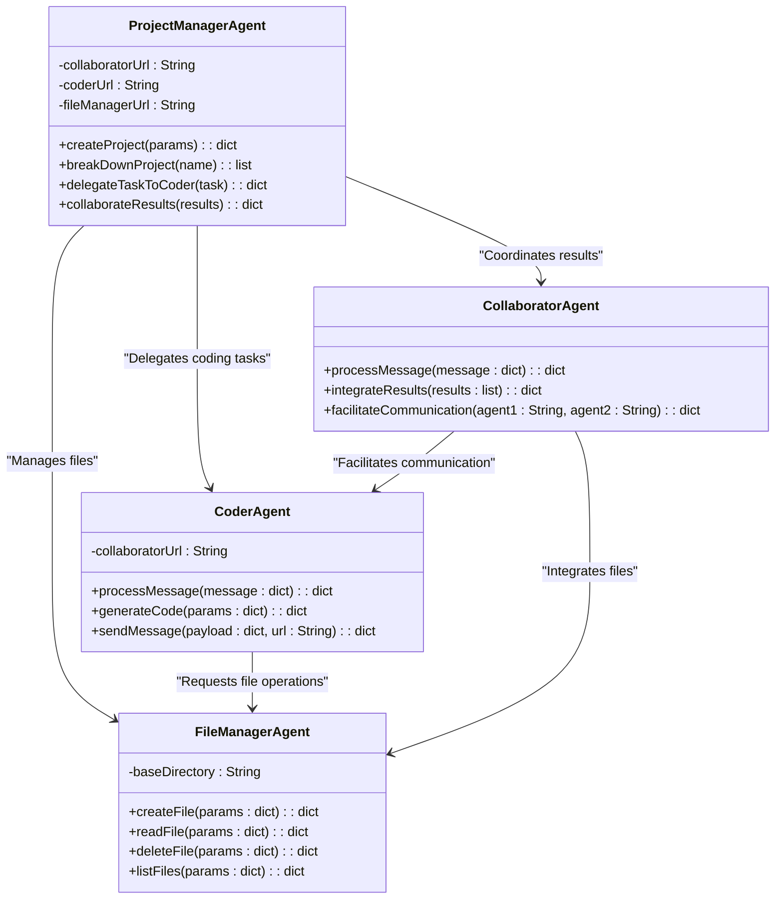

Please summarize what we have talked about so far.   Create a markdown downloadable document that I can paste into vscode and show my design team and my stakeholders our plans. Remember that we want a coder, planner, collaborator and human on this team so far.  The goal is to have a communication system that will help us perform software development tasks.  We are going to expand on this design, so keep that in mind as you create the document.  We have not started any coding yet aside from the examples that I have pasted in.  I am going to use this document as a guide for this Agent communication network.


# Software Development Multi-Agent System Design Plan

## Overview

We are designing a **Multi-Agent Communication System** for software development tasks. The goal is to have a team of agents, including humans, collaborating to efficiently break down and execute complex software projects.

---

## Key Roles in the System

### 1. **ProjectManagerAgent**
   - **Role**: Acts as the team leader. Breaks down high-level project requirements into actionable tasks and delegates them to the appropriate agents.
   - **Responsibilities**:
     - Receive high-level project requirements.
     - Break down the project into smaller, actionable tasks.
     - Assign tasks to other agents.
     - Monitor progress and ensure the integration of all components.

### 2. **CoderAgent**
   - **Role**: Writes and generates code based on tasks assigned by the `ProjectManagerAgent`.
   - **Responsibilities**:
     - Receive tasks from the `ProjectManagerAgent`.
     - Generate modular, testable code for specific tasks.
     - Interact with the `FileManagerAgent` to save and retrieve files.

### 3. **CollaboratorAgent**
   - **Role**: Facilitates communication between agents, integrates their outputs, and ensures smooth collaboration.
   - **Responsibilities**:
     - Handle communication between agents.
     - Track progress of tasks.
     - Integrate outputs into a cohesive final product.

### 4. **FileManagerAgent**
   - **Role**: Handles file and directory operations, such as creating, reading, and managing project files.
   - **Responsibilities**:
     - Manage files and directories for the project.
     - Support file creation, reading, deletion, and listing.
     - Ensure that files are accessible to other agents.

### 5. **Human**
   - **Role**: Oversees the system, provides high-level input, and reviews the final output.
   - **Responsibilities**:
     - Provide initial project requirements.
     - Monitor the system's performance and outputs.
     - Validate the final deliverables.

---

## System Design Diagram



---

## Workflow Steps

1. **Project Initialization**:
   - A human provides a high-level requirement, such as "Build a tennis game."
   - The `ProjectManagerAgent` breaks this into tasks.  In the example of a tennis game, the tasks might include for example:
     - Implement game logic.
     - Create scoring system.
     - Design the user interface.

2. **Task Delegation**:
   - The `ProjectManagerAgent` assigns coding tasks to the `CoderAgent`.
   - The `CollaboratorAgent` oversees communication between agents and tracks progress.

3. **Code Writing**:
   - The `CoderAgent` generates code and saves it using the `FileManagerAgent`.

4. **Integration**:
   - The `CollaboratorAgent` combines and tests the outputs to ensure they work together.

5. **Finalization**:
   - The `ProjectManagerAgent` reviews the integrated output and provides it to the human for approval.

---

## Road Map

### Phase 1: Initial Implementation
1. Create the Chat Client and talk to the file system mcp.  Set up communication between the chat client and the File Manager using the Model Context Protocol (MCP).
2. Implement the `FileManagerAgent` to handle basic file operations.
3. Start the FileManagerAgent and the Chat Client.
4. Test basic file operations using the Chat Client.

### Phase 2: Collaboration and Delegation
3. Build the `CoderAgent` to generate code and interact with the `FileManagerAgent`.
4. Implement the `CollaboratorAgent` to manage communication between agents.
5. Develop the `ProjectManagerAgent` to break down projects and assign tasks.

### Phase 3: System Integration and Testing
6. Create end-to-end workflows to test the system on sample projects.
7. Allow human users to interact with the system via a user interface.

### Phase 4: Advanced Features
8. Add version control capabilities to the `FileManagerAgent`.
9. Introduce machine learning models for task optimization in the `ProjectManagerAgent`.
10. Enable real-time collaboration between human users and agents.

---

## Plan Summary

This system is designed to mimic a **collaborative software development team**. Each agent plays a specific role to ensure efficiency and modularity. By starting small and iteratively building out the system, we’ll create a flexible and scalable solution for tackling software development tasks.


# What we have to work with so far
```python
import json
import socket
from jsonrpc import JSONRPCResponseManager, dispatcher
from xmlrpc.server import SimpleXMLRPCServer, SimpleXMLRPCRequestHandler
from abc import ABC, abstractmethod
import psutil
import threading
from datetime import datetime

class BaseAgentLogger:
    def __init__(self):
        pass

    def info(self, message):
        print(f"INFO [{datetime.now()}]: {message}")

    def error(self, message):
        print(f"*** ERROR [{datetime.now()}]: {message} ***")

def is_port_in_use(port):
    with socket.socket(socket.AF_INET, socket.SOCK_STREAM) as s:
        return s.connect_ex(('localhost', port)) == 0

def kill_process_on_port(port):
    for proc in psutil.process_iter(['pid', 'name']):
        try:
            for conn in proc.connections(kind='inet'):
                if conn.laddr.port == port:
                    print(f"Killing process {proc.info['name']} (PID: {proc.info['pid']}) on port {port}")
                    proc.kill()
        except psutil.AccessDenied:
            print(f"Access denied when attempting to kill process on port {port}")
        except psutil.NoSuchProcess:
            print(f"Process on port {port} no longer exists")

def validate_mcp_message(message):
    required_keys = ["jsonrpc", "method", "params", "id"]
    for key in required_keys:
        if key not in message:
            raise ValueError(f"Missing required key in MCP message: {key}")

class ThreadedXMLRPCServer(SimpleXMLRPCServer, threading.Thread):
    allow_reuse_address = True

    def __init__(self, server_address, RequestHandlerClass=SimpleXMLRPCRequestHandler, bind_and_activate=True):
        SimpleXMLRPCServer.__init__(self, server_address, RequestHandlerClass, bind_and_activate)
        threading.Thread.__init__(self)
        self.daemon = True

    def run(self):
        self.serve_forever()

class BaseAgent(ABC):
    def __init__(self, agent_id: str, server_port: int):
        self.agent_id = agent_id
        self.server_port = server_port
        self.logger = BaseAgentLogger()

    def run(self):
        self.logger.info(f"Agent {self.agent_id} starting on port {self.server_port}.")

        if is_port_in_use(self.server_port):
            self.logger.info(f"Port {self.server_port} is in use. Killing the process...")
            kill_process_on_port(self.server_port)

        if is_port_in_use(self.server_port):
            self.logger.error(f"Port {self.server_port} is still in use after attempting to kill the process.")
            return

        # Threaded MCP JSON-RPC Server
        with ThreadedXMLRPCServer(("localhost", self.server_port), allow_none=True) as server:
            server.register_instance(self)
            self.logger.info(f"Agent {self.agent_id} listening on port {self.server_port}.")
            server.run()

    def send_mcp_message(self, method, params, recipient_url):
        try:
            payload = {
                "jsonrpc": "2.0",
                "method": method,
                "params": params,
                "id": 1
            }
            validate_mcp_message(payload)
            response = JSONRPCResponseManager.handle(json.dumps(payload), dispatcher)
            self.logger.info(f"Sent MCP message to {recipient_url}: {response}")
            return response.data
        except ValueError as ve:
            self.logger.error(f"Validation error in MCP message: {str(ve)}")
        except Exception as e:
            self.logger.error(f"Error sending MCP message: {str(e)}")
        return None

    @abstractmethod
    def process_message(self, message: dict):
        pass

    def mcp_context_request(self, context):
        """
        Handle incoming MCP context requests.
        """
        self.logger.info(f"Processing MCP context request: {context}")
        # Implement logic to process the context request
        return {"status": "success", "context": context}
```


# Your Task
We are going to use this Base Agent in all agents that we build including the FileManagerAgent.  Please review the BaseAgent code and make sure that it aligns with what we know about Agent Model Context Protocol Communication.  If you are not sure what MCP is, please look it up.  It is an Agent communication protocol that Anthropic is using.

