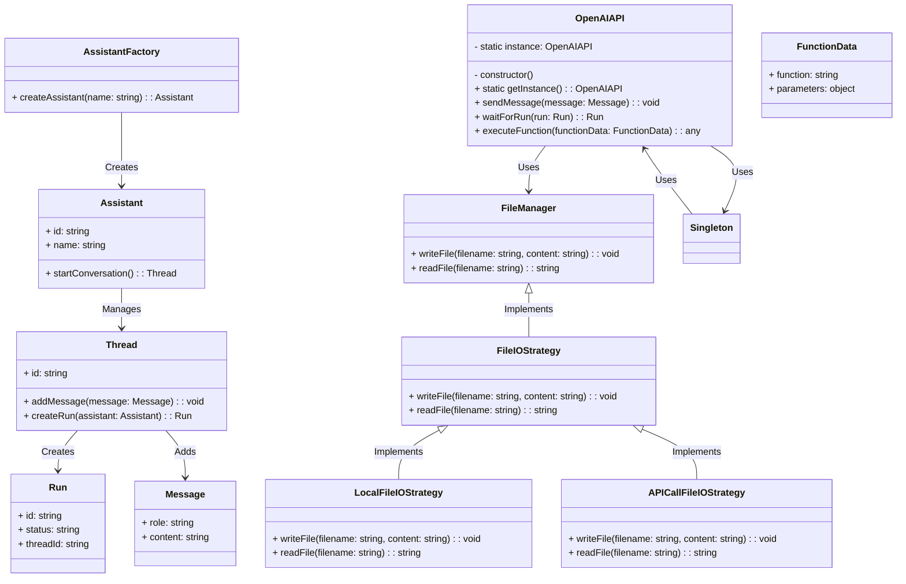
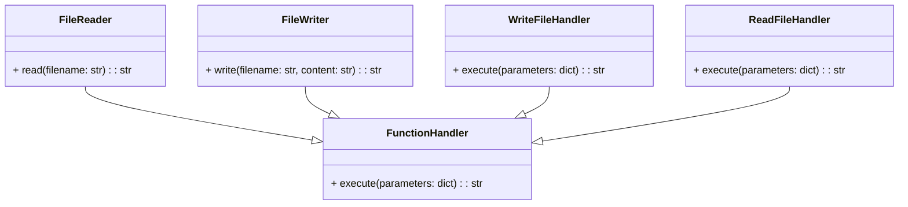
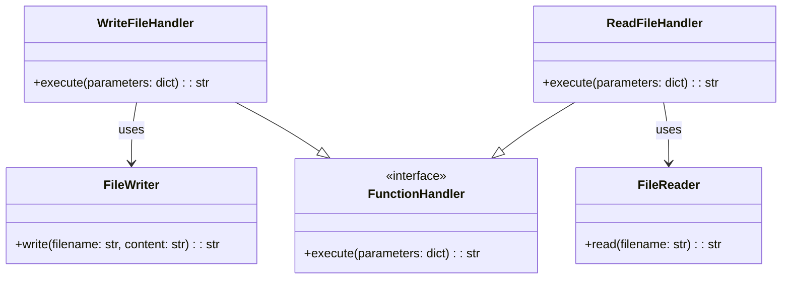
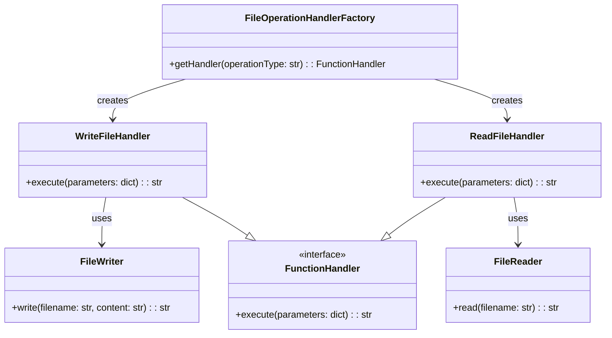
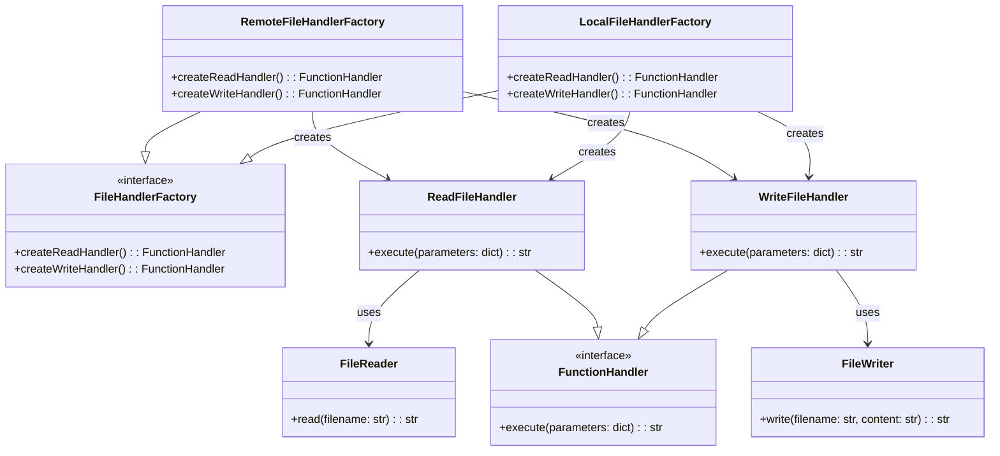

# Another idea


# Simpler, I think..

I don't think that this diagram is correct.  It doesn't seem to fit in with the rest of the system.  Can you see what is wrong and how we can either fix it, or fix the system that it belongs to.  I like the concept of using different strategies for handling IO, but something about the diagram below isn't right.  The inheritance arrows are wrong, i think..

# incorrect diagram

# fixed diagram


When you are finished finding out what may or may not be wrong with the Strategy implementation, make another class diagram for the final system that we are going to use.





# Introducing the Abstract Factory Pattern

```mermaid
class FileHandlerFactory:
    def create_read_handler(self):
        pass
    def create_write_handler(self):
        pass

class LocalFileHandlerFactory(FileHandlerFactory):
    def create_read_handler(self):
        return ReadFileHandler(FileReader())
    def create_write_handler(self):
        return WriteFileHandler(FileWriter())

class RemoteFileHandlerFactory(FileHandlerFactory):
    def create_read_handler(self):
        return ReadFileHandler(RemoteFileReader())
    def create_write_handler(self):
        return WriteFileHandler(RemoteFileWriter())

class FunctionHandler:
    def execute(self, parameters):
        raise NotImplementedError

class ReadFileHandler(FunctionHandler):
    def __init__(self, reader):
        self.reader = reader
    def execute(self, parameters):
        return self.reader.read(parameters["filename"])

class WriteFileHandler(FunctionHandler):
    def __init__(self, writer):
        self.writer = writer
    def execute(self, parameters):
        return self.writer.write(parameters["filename"], parameters["content"])

class FileReader:
    def read(self, filename):
        with open(filename, 'r') as file:
            return file.read()

class FileWriter:
    def write(self, filename, content):
        with open(filename, 'w') as file:
            file.write(content)
```

