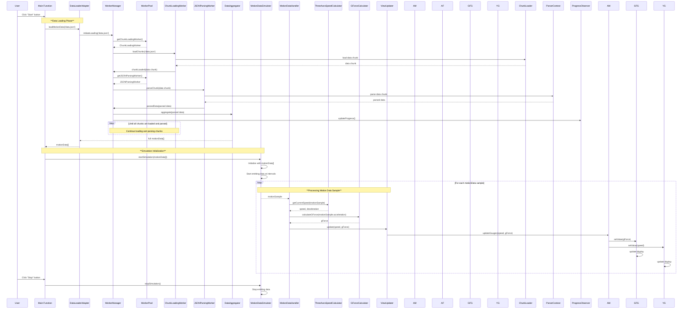

```mermaid
sequenceDiagram
    %% Participants
    participant User
    participant Main as Main Function
    participant DataLoaderAdapter
    participant WorkerManager
    participant WorkerPool
    participant ChunkLoadingWorker
    participant JSONParsingWorker
    participant DataAggregator
    participant MotionDataSimulator
    participant MotionDataHandler
    participant ThreeAxesSpeedCalculator
    participant GForceCalculator
    participant ViewUpdater
    participant AnimationManager as AM
    participant Animator as AF
    participant GForceGauge as GFG
    participant YawGauge as YG

    %% User Initiates Simulation
    User ->> Main: Click "Start" button

    %% Data Loading Phase
    Note over Main, DataLoaderAdapter: **Data Loading Phase**
    Main ->> DataLoaderAdapter: loadMotionData('data.json')
    DataLoaderAdapter ->> WorkerManager: initiateLoading('data.json')
    WorkerManager ->> WorkerPool: getChunkLoadingWorker()
    WorkerPool -->> WorkerManager: ChunkLoadingWorker
    WorkerManager ->> ChunkLoadingWorker: loadChunks('data.json')
    ChunkLoadingWorker ->> ChunkLoader: load data chunk
    ChunkLoader -->> ChunkLoadingWorker: data chunk
    ChunkLoadingWorker ->> WorkerManager: chunkLoaded(data chunk)
    WorkerManager ->> WorkerPool: getJSONParsingWorker()
    WorkerPool -->> WorkerManager: JSONParsingWorker
    WorkerManager ->> JSONParsingWorker: parseChunk(data chunk)
    JSONParsingWorker ->> ParserContext: parse data chunk
    ParserContext -->> JSONParsingWorker: parsed data
    JSONParsingWorker ->> WorkerManager: parsedData(parsed data)
    WorkerManager ->> DataAggregator: aggregate(parsed data)
    WorkerManager ->> ProgressObserver: updateProgress()
    loop Until all chunks are loaded and parsed
        Note over ChunkLoadingWorker, WorkerManager: Continue loading and parsing chunks
    end
    DataAggregator -->> DataLoaderAdapter: full motionData[]
    DataLoaderAdapter -->> Main: motionData[]

    %% Simulation Initialization
    Note over Main, MotionDataSimulator: **Simulation Initialization**
    Main ->> MotionDataSimulator: startSimulation(motionData[])
    MotionDataSimulator ->> MotionDataSimulator: Initialize with motionData[]
    MotionDataSimulator ->> MotionDataSimulator: Start emitting data at intervals

    %% Motion Data Processing Loop
    loop For each motionData sample
        Note over MotionDataSimulator, ViewUpdater: **Processing Motion Data Sample**
        MotionDataSimulator -->> MotionDataHandler: motionSample
        MotionDataHandler ->> ThreeAxesSpeedCalculator: getCurrentSpeed(motionSample)
        ThreeAxesSpeedCalculator -->> MotionDataHandler: speed, deceleration
        MotionDataHandler ->> GForceCalculator: calculateGForce(motionSample.acceleration)
        GForceCalculator -->> MotionDataHandler: gForce
        MotionDataHandler ->> ViewUpdater: update(speed, gForce)

        %% Updating the Gauges
        ViewUpdater ->> AM: updateGauges(speed, gForce)
        AM ->> GFG: setValue(gForce)
        AM ->> YG: setValue(speed)
        GFG ->> GFG: update display
        YG ->> YG: update display
    end

    %% User Stops Simulation
    User ->> Main: Click "Stop" button
    Main ->> MotionDataSimulator: stopSimulation()
    MotionDataSimulator ->> MotionDataSimulator: Stop emitting data
```