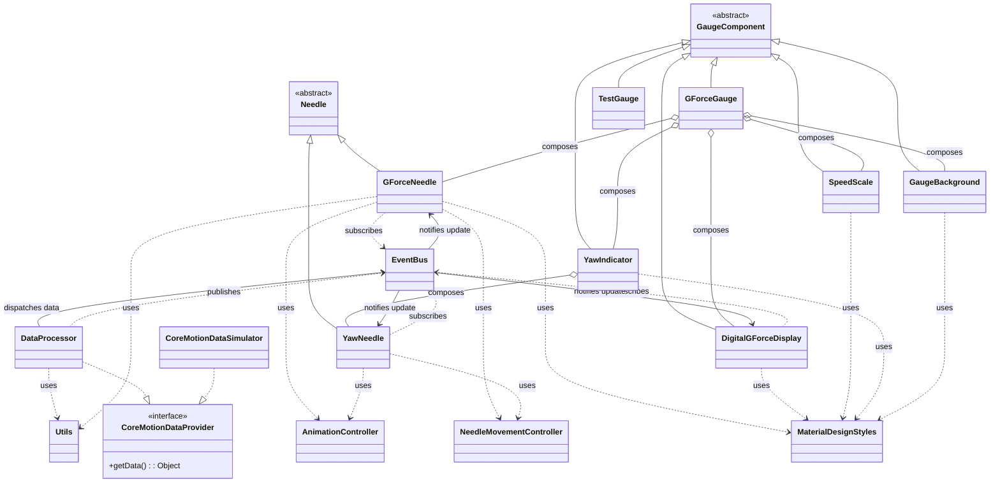
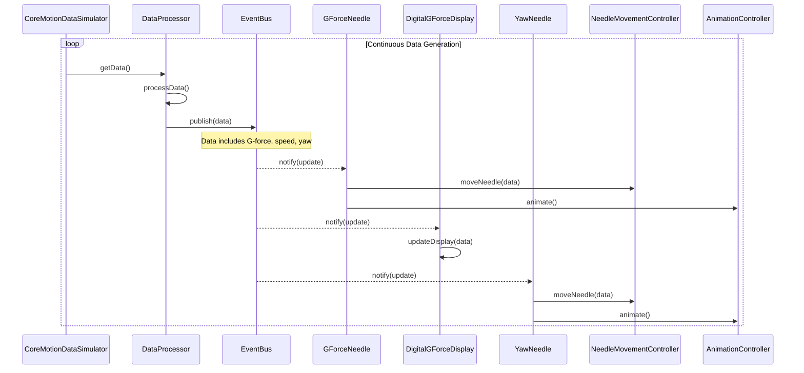

# Gauge Class Diagram

```mermaid
classDiagram
    %% Abstract Classes and Interfaces
    class GaugeComponent {
        <<abstract>>
    }
    class Needle {
        <<abstract>>
    }
    class CoreMotionDataProvider {
        <<interface>>
        +getData() : Object
    }

    %% Concrete Components
    class GForceGauge
    class DigitalGForceDisplay
    class SpeedScale
    class YawIndicator
    class GaugeBackground
    class TestGauge

    class GForceNeedle
    class YawNeedle

    %% Controllers and Utilities
    class NeedleMovementController
    class AnimationController
    class DataProcessor
    class EventBus
    class CoreMotionDataSimulator
    class MaterialDesignStyles
    class Utils

    %% Relationships
    GaugeComponent <|-- GForceGauge
    GaugeComponent <|-- DigitalGForceDisplay
    GaugeComponent <|-- SpeedScale
    GaugeComponent <|-- YawIndicator
    GaugeComponent <|-- GaugeBackground
    GaugeComponent <|-- TestGauge

    Needle <|-- GForceNeedle
    Needle <|-- YawNeedle

    GForceGauge o-- GForceNeedle : composes
    GForceGauge o-- DigitalGForceDisplay : composes
    GForceGauge o-- SpeedScale : composes
    GForceGauge o-- YawIndicator : composes
    GForceGauge o-- GaugeBackground : composes

    YawIndicator o-- YawNeedle : composes

    GForceNeedle ..> NeedleMovementController : uses
    YawNeedle ..> NeedleMovementController : uses

    GForceNeedle ..> AnimationController : uses
    YawNeedle ..> AnimationController : uses

    GForceNeedle ..> MaterialDesignStyles : uses
    DigitalGForceDisplay ..> MaterialDesignStyles : uses
    SpeedScale ..> MaterialDesignStyles : uses
    YawIndicator ..> MaterialDesignStyles : uses
    GaugeBackground ..> MaterialDesignStyles : uses

    DataProcessor ..|> CoreMotionDataProvider
    CoreMotionDataSimulator ..|> CoreMotionDataProvider

    DataProcessor ..> EventBus : publishes
    GForceNeedle ..> EventBus : subscribes
    DigitalGForceDisplay ..> EventBus : subscribes
    YawNeedle ..> EventBus : subscribes

    DataProcessor ..> Utils : uses
    GForceNeedle ..> Utils : uses

    EventBus <-- DataProcessor : dispatches data
    EventBus --> GForceNeedle : notifies update
    EventBus --> DigitalGForceDisplay : notifies update
    EventBus --> YawNeedle : notifies update
```

#
#
# Sequence Diagram for the same system

```mermaid
sequenceDiagram
    participant CoreMotionDataSimulator as CoreMotionDataSimulator
    participant DataProcessor as DataProcessor
    participant EventBus as EventBus
    participant GForceNeedle as GForceNeedle
    participant DigitalGForceDisplay as DigitalGForceDisplay
    participant YawNeedle as YawNeedle

    loop Continuous Data Generation
        CoreMotionDataSimulator->>DataProcessor: getData()
        DataProcessor->>DataProcessor: processData()
        DataProcessor->>EventBus: publish(data)
        Note over EventBus: Data includes G-force, speed, yaw
        EventBus-->>GForceNeedle: notify(update)
        GForceNeedle->>NeedleMovementController: moveNeedle(data)
        GForceNeedle->>AnimationController: animate()
        EventBus-->>DigitalGForceDisplay: notify(update)
        DigitalGForceDisplay->>DigitalGForceDisplay: updateDisplay(data)
        EventBus-->>YawNeedle: notify(update)
        YawNeedle->>NeedleMovementController: moveNeedle(data)
        YawNeedle->>AnimationController: animate()
    end
```