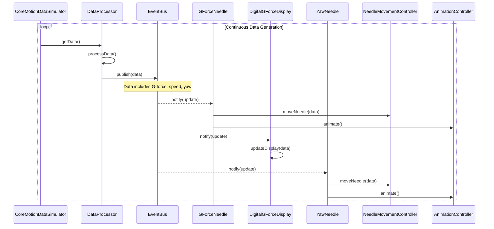

```mermaid
sequenceDiagram
    participant CoreMotionDataSimulator as CoreMotionDataSimulator
    participant DataProcessor as DataProcessor
    participant EventBus as EventBus
    participant GForceNeedle as GForceNeedle
    participant DigitalGForceDisplay as DigitalGForceDisplay
    participant YawNeedle as YawNeedle

    loop Continuous Data Generation
        CoreMotionDataSimulator->>DataProcessor: getData()
        DataProcessor->>DataProcessor: processData()
        DataProcessor->>EventBus: publish(data)
        Note over EventBus: Data includes G-force, speed, yaw
        EventBus-->>GForceNeedle: notify(update)
        GForceNeedle->>NeedleMovementController: moveNeedle(data)
        GForceNeedle->>AnimationController: animate()
        EventBus-->>DigitalGForceDisplay: notify(update)
        DigitalGForceDisplay->>DigitalGForceDisplay: updateDisplay(data)
        EventBus-->>YawNeedle: notify(update)
        YawNeedle->>NeedleMovementController: moveNeedle(data)
        YawNeedle->>AnimationController: animate()
    end
```