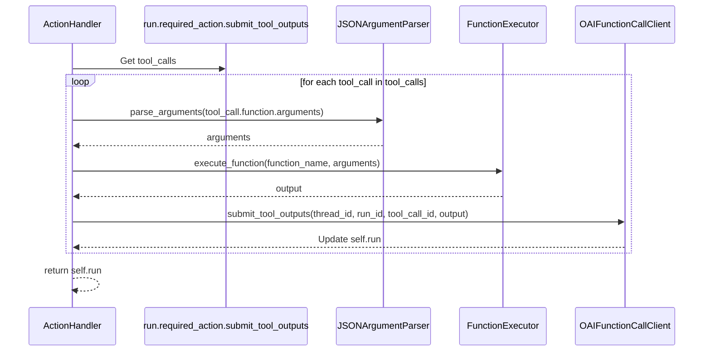

```mermaid
sequenceDiagram
    participant AH as ActionHandler
    participant RP as run.required_action.submit_tool_outputs
    participant JAP as JSONArgumentParser
    participant FE as FunctionExecutor
    participant OAI as OAIFunctionCallClient

    AH->>RP: Get tool_calls
    loop for each tool_call in tool_calls
        AH->>JAP: parse_arguments(tool_call.function.arguments)
        JAP-->>AH: arguments

        AH->>FE: execute_function(function_name, arguments)
        FE-->>AH: output

        AH->>OAI: submit_tool_outputs(thread_id, run_id, tool_call_id, output)
        OAI-->>AH: Update self.run
    end
    AH-->>AH: return self.run
```
