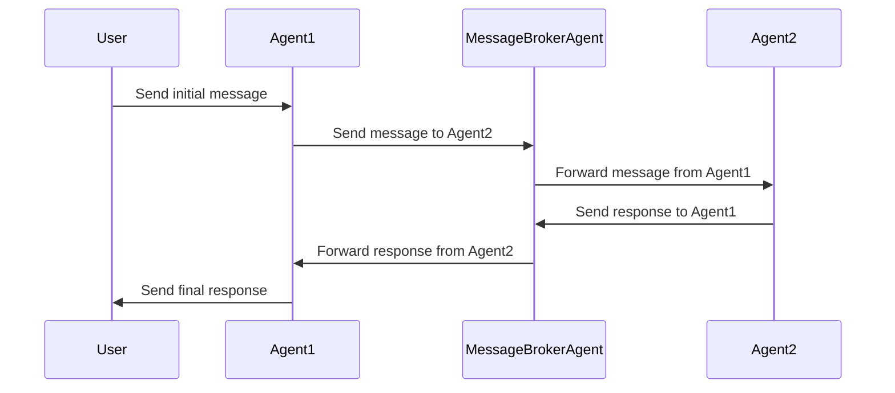

# Design and Development Plan for Base Agent and Message Broker Agent

## Table of Contents
- [Introduction](#introduction)
- [System Overview](#system-overview)
- [Agents Overview](#agents-overview)
  - [Base Agent](#base-agent)
  - [Message Broker Agent](#message-broker-agent)
- [Inter-Agent Communication](#inter-agent-communication)
  - [Mailbox Interface](#mailbox-interface)
  - [Message Format](#message-format)
- [Design Specifications](#design-specifications)
  - [Base Agent Design](#base-agent-design)
  - [Message Broker Agent Design](#message-broker-agent-design)
- [Implementation Plan](#implementation-plan)
  - [Step 1: Define Mailbox Interface](#step-1-define-mailbox-interface)
  - [Step 2: Implement Base Agent](#step-2-implement-base-agent)
  - [Step 3: Implement Message Broker Agent](#step-3-implement-message-broker-agent)
  - [Step 4: Testing and Validation](#step-4-testing-and-validation)
- [Agent Communication Sequence Diagram](#agent-communication-sequence-diagram)
- [Next Steps](#next-steps)
- [Appendix](#appendix)
  - [Message Types](#message-types)
  - [Sample Code Snippets](#sample-code-snippets)

---

## Introduction

This document outlines the design and development plan for building the **Base Agent** and the **Message Broker Agent** (MessageCollaboratorAgent) for our Agent-Based Test-Driven Development (TDD) system. The goal is to establish a robust foundation for inter-agent communication and agent functionality, enabling agents to communicate with users and other agents seamlessly, even across hardware boundaries.

---

## System Overview

In our system, each agent operates in its own process and communicates via mailbox files. Agents periodically check their mailboxes for new messages. By abstracting the mailbox interface, we ensure flexibility in the communication medium, allowing for future implementations using remote files, databases, web sockets, etc.

---

## Agents Overview

### Base Agent

The **Base Agent** serves as the foundational class from which all other agents inherit common functionalities such as message handling, mailbox management, and logging. It encapsulates the core behaviors required by any agent in the system.

**Key Responsibilities:**
- Initialize agent-specific configurations.
- Manage the agent's mailbox for sending and receiving messages.
- Provide a standard interface for message processing.
- Handle logging and error reporting.

### Message Broker Agent

The **Message Broker Agent** (MessageCollaboratorAgent) acts as the central hub for routing messages between agents. It ensures that messages are delivered to the appropriate recipient's mailbox, enabling decoupled communication.

**Key Responsibilities:**
- Receive messages from agents.
- Determine the appropriate recipient(s) for each message.
- Forward messages to the recipient's mailbox.
- Handle message acknowledgments and retries in case of failures.

---

## Inter-Agent Communication

### Mailbox Interface

To facilitate communication between agents, we will implement a **Mailbox Interface** that abstracts the underlying communication mechanism. This interface allows agents to read from and write to their mailboxes without concern for the physical implementation.

**Features:**
- **Abstraction:** Agents interact with a consistent API regardless of the mailbox's underlying technology.
- **Extensibility:** The interface can support various implementations (e.g., local files, databases, network sockets).
- **Isolation:** Each agent has its own mailbox, ensuring message privacy and security.

### Message Format

Messages exchanged between agents will follow a predefined JSON-based format to ensure consistency and ease of parsing.

**Standard Message Fields:**
- `message_type`: The type/category of the message (e.g., `test_case`, `generated_code`).
- `sender`: The ID or name of the sending agent.
- `receiver`: The ID or name of the recipient agent.
- `timestamp`: The time the message was sent.
- `payload`: The content of the message, which may include additional nested data.

**Example:**
```json
{
  "message_type": "test_case",
  "sender": "TestCaseGeneratorAgent",
  "receiver": "CodeGeneratorAgent",
  "timestamp": "2024-11-17T12:00:00Z",
  "payload": {
    "test_case_id": "TC001",
    "description": "Test addition function with positive integers.",
    "input": [2, 3],
    "expected_output": 5
  }
}
```

---

## Design Specifications

### Base Agent Design

**Class Structure:**
- **BaseAgent**
  - **Attributes:**
    - `agent_id`: Unique identifier for the agent.
    - `mailbox`: Instance of the Mailbox Interface.
    - `logger`: Logging utility.
  - **Methods:**
    - `run()`: Main loop for the agent's operation.
    - `process_message(message)`: Abstract method to handle incoming messages.
    - `send_message(message)`: Sends a message via the Mailbox Interface.
    - `receive_messages()`: Checks the mailbox for new messages.
    - `initialize()`: Sets up agent configurations.

**Behavior:**
- The `run()` method starts the agent's main loop, which involves checking for new messages and processing them.
- The `process_message()` method must be implemented by derived agents to define specific message handling logic.
- Logging is integrated for monitoring and debugging purposes.

### Message Broker Agent Design

**Class Structure:**
- **MessageBrokerAgent** (inherits from **BaseAgent**)
  - **Attributes:**
    - `routing_table`: Data structure mapping message types to recipient agents.
  - **Methods:**
    - `process_message(message)`: Overrides the BaseAgent method to implement message routing logic.
    - `route_message(message)`: Determines the recipient and forwards the message.
    - `update_routing_table()`: Manages dynamic updates to the routing configurations.

**Behavior:**
- The `process_message()` method examines incoming messages and uses the `route_message()` method to forward them appropriately.
- The agent maintains a `routing_table` to map message types or specific messages to recipient agents.
- It ensures reliable message delivery, handling retries if necessary.

---

## Implementation Plan

### Step 1: Define Mailbox Interface

**Objective:** Create an abstract interface for the mailbox system to support different implementations.

**Actions:**
- Define a `MailboxInterface` class with the following methods:
  - `send(message, recipient_id)`: Sends a message to a recipient's mailbox.
  - `receive()`: Retrieves new messages from the agent's mailbox.
- Implement a basic file-based mailbox (`FileMailbox`) as the initial concrete implementation.
- Ensure thread safety if agents are multi-threaded.

### Step 2: Implement Base Agent

**Objective:** Develop the Base Agent class that other agents will inherit from.

**Actions:**
- Create the `BaseAgent` class with the structure outlined in the design specifications.
- Implement the main loop in the `run()` method to periodically check for messages.
- Provide a default implementation for `send_message()` and `receive_messages()`.
- Use the `MailboxInterface` for all mailbox interactions.
- Incorporate logging at key points (e.g., message sent, message received, errors).

### Step 3: Implement Message Broker Agent

**Objective:** Develop the Message Broker Agent to handle message routing between agents.

**Actions:**
- Create the `MessageBrokerAgent` class inheriting from `BaseAgent`.
- Implement the `process_message()` method to handle incoming messages and route them.
- Initialize the `routing_table` with mappings based on the system design.
- Ensure the agent can handle multiple messages and high throughput.
- Add logging for message routing actions.

### Step 4: Testing and Validation

**Objective:** Ensure the Base Agent and Message Broker Agent function correctly.

**Actions:**
- Write unit tests for the `MailboxInterface` and its file-based implementation.
- Create mock agents inheriting from `BaseAgent` to test message sending and receiving.
- Test the Message Broker Agent's ability to route messages between agents.
- Simulate various scenarios, including message loss and retry mechanisms.
- Validate that agents can communicate with both users and other agents.

---

## Agent Communication Sequence Diagram



---

## Next Steps

1. **Review Interface Definitions:**
   - Ensure the `MailboxInterface` meets all requirements for current and future implementations.
2. **Finalize Message Formats:**
   - Standardize message structures and document all possible message types and their payloads.
3. **Develop Derived Agents:**
   - After the Base Agent and Message Broker Agent are operational, begin implementing other agents like `TestCaseGeneratorAgent`.
4. **Integration Testing:**
   - Test the system with multiple agents running in separate processes to validate inter-agent communication.
5. **Scalability Considerations:**
   - Evaluate performance and plan for optimizations to handle increased load.

---

## Appendix

### Message Types

The following are standard message types that agents will use for communication:

- `test_case`: Sent by `TestCaseGeneratorAgent` to `CodeGeneratorAgent`.
- `generated_code`: Sent by `CodeGeneratorAgent` to `TestRunnerAgent`.
- `test_results`: Sent by `TestRunnerAgent` to `FeedbackAnalyzerAgent`.
- `feedback`: Sent by `FeedbackAnalyzerAgent` to `ProjectManagerAgent`.
- `task_assignment`: Sent by `ProjectManagerAgent` to assign tasks to agents.

### Sample Code Snippets

**Mailbox Interface Definition (Python Example):**
```python
from abc import ABC, abstractmethod

class IMailbox( ABC ):
    @abstractmethod
    def send(self, message: dict, recipient_id: str) -> None:
        pass

    @abstractmethod
    def receive(self) -> list:
        pass
```

**File-Based Mailbox Implementation:**
```python
import json
import os

class FileMailbox( IMailbox ):
    def __init__(self, agent_id: str, mailbox_dir: str = "./mailboxes"):
        self.agent_id = agent_id
        self.mailbox_path = os.path.join(mailbox_dir, f"{agent_id}.mbox")
        os.makedirs(mailbox_dir, exist_ok=True)

    def send(self, message: dict, recipient_id: str) -> None:
        recipient_mailbox = os.path.join("./mailboxes", f"{recipient_id}.mbox")
        with open(recipient_mailbox, 'a') as mbox:
            mbox.write(json.dumps(message) + '
')

    def receive(self) -> list:
        messages = []
        if os.path.exists(self.mailbox_path):
            with open(self.mailbox_path, 'r') as mbox:
                for line in mbox:
                    messages.append(json.loads(line))
            # Clear mailbox after reading
            open(self.mailbox_path, 'w').close()
        return messages
```

**Base Agent Class Skeleton:**
```python
class BaseAgent:
    def __init__(self, agent_id: str):
        self.agent_id = agent_id
        self.mailbox = FileMailbox(agent_id)
        self.logger = self.initialize_logger()

    def run(self):
        self.logger.info(f"Agent {self.agent_id} started.")
        while True:
            messages = self.receive_messages()
            for message in messages:
                self.process_message(message)
            # Sleep or wait for a specific interval
            time.sleep(1)

    def send_message(self, message: dict, recipient_id: str):
        self.mailbox.send(message, recipient_id)
        self.logger.info(f"Sent message to {recipient_id}: {message}")

    def receive_messages(self):
        messages = self.mailbox.receive()
        if messages:
            self.logger.info(f"Received messages: {messages}")
        return messages

    def process_message(self, message: dict):
        raise NotImplementedError("Subclasses should implement this method.")

    def initialize_logger(self):
        # Set up logging configuration
        pass
```

