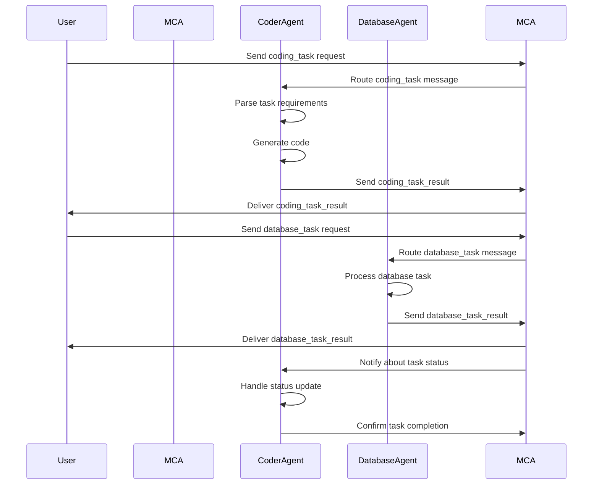

```mermaid
sequenceDiagram
    participant User
    participant MessageCollaboratorAgent as MCA
    participant CoderAgent
    participant DatabaseAgent

    User->>MCA: Send coding_task request
    MCA->>CoderAgent: Route coding_task message
    CoderAgent->>CoderAgent: Parse task requirements
    CoderAgent->>CoderAgent: Generate code
    CoderAgent->>MCA: Send coding_task_result
    MCA->>User: Deliver coding_task_result

    User->>MCA: Send database_task request
    MCA->>DatabaseAgent: Route database_task message
    DatabaseAgent->>DatabaseAgent: Process database task
    DatabaseAgent->>MCA: Send database_task_result
    MCA->>User: Deliver database_task_result

    MCA->>CoderAgent: Notify about task status
    CoderAgent->>CoderAgent: Handle status update
    CoderAgent->>MCA: Confirm task completion
```