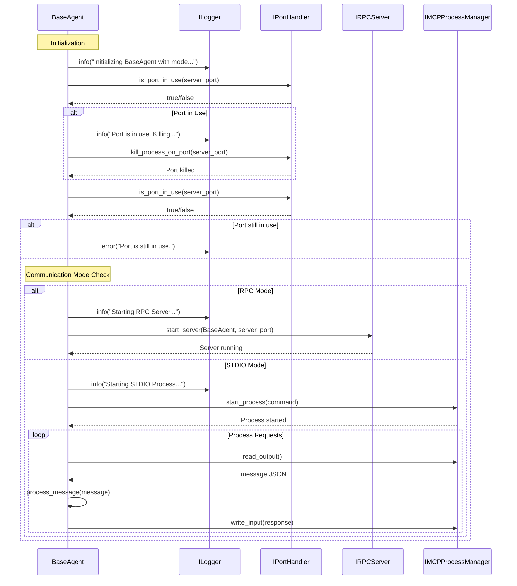

```mermaid
sequenceDiagram
    participant BaseAgent
    participant ILogger as ILogger
    participant IPortHandler as IPortHandler
    participant IRPCServer as IRPCServer
    participant IMCPProcessManager as IMCPProcessManager

    Note over BaseAgent: Initialization
    BaseAgent ->> ILogger: info("Initializing BaseAgent with mode...")
    BaseAgent ->> IPortHandler: is_port_in_use(server_port)
    IPortHandler -->> BaseAgent: true/false

    alt Port in Use
        BaseAgent ->> ILogger: info("Port is in use. Killing...")
        BaseAgent ->> IPortHandler: kill_process_on_port(server_port)
        IPortHandler -->> BaseAgent: Port killed
    end

    BaseAgent ->> IPortHandler: is_port_in_use(server_port)
    IPortHandler -->> BaseAgent: true/false
    alt Port still in use
        BaseAgent ->> ILogger: error("Port is still in use.")
    else
        Note over BaseAgent: Communication Mode Check
        alt RPC Mode
            BaseAgent ->> ILogger: info("Starting RPC Server...")
            BaseAgent ->> IRPCServer: start_server(BaseAgent, server_port)
            IRPCServer -->> BaseAgent: Server running
        else STDIO Mode
            BaseAgent ->> ILogger: info("Starting STDIO Process...")
            BaseAgent ->> IMCPProcessManager: start_process(command)
            IMCPProcessManager -->> BaseAgent: Process started
            loop Process Requests
                BaseAgent ->> IMCPProcessManager: read_output()
                IMCPProcessManager -->> BaseAgent: message JSON
                BaseAgent ->> BaseAgent: process_message(message)
                BaseAgent ->> IMCPProcessManager: write_input(response)
            end
        end
    end
```
