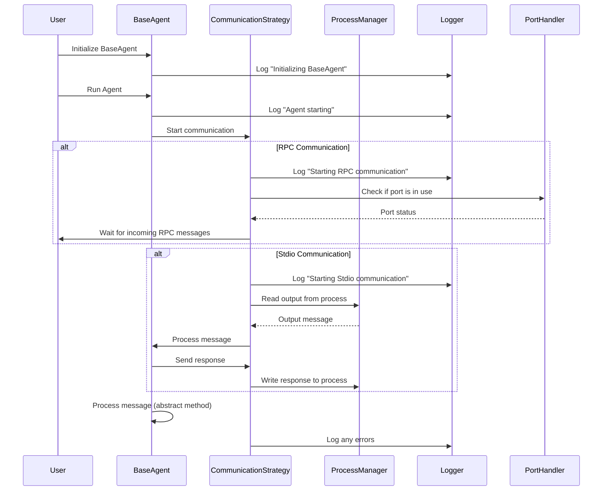

```mermaid
sequenceDiagram
    participant User
    participant BaseAgent
    participant CommunicationStrategy
    participant ProcessManager
    participant Logger
    participant PortHandler

    User->>BaseAgent: Initialize BaseAgent
    BaseAgent->>Logger: Log "Initializing BaseAgent"
    User->>BaseAgent: Run Agent
    BaseAgent->>Logger: Log "Agent starting"
    BaseAgent->>CommunicationStrategy: Start communication
    
    alt RPC Communication
        CommunicationStrategy->>Logger: Log "Starting RPC communication"
        CommunicationStrategy->>PortHandler: Check if port is in use
        PortHandler-->>CommunicationStrategy: Port status
        CommunicationStrategy->>User: Wait for incoming RPC messages
    end
    
    alt Stdio Communication
        CommunicationStrategy->>Logger: Log "Starting Stdio communication"
        CommunicationStrategy->>ProcessManager: Read output from process
        ProcessManager-->>CommunicationStrategy: Output message
        CommunicationStrategy->>BaseAgent: Process message
        BaseAgent->>CommunicationStrategy: Send response
        CommunicationStrategy->>ProcessManager: Write response to process
    end

    BaseAgent->>BaseAgent: Process message (abstract method)
    CommunicationStrategy->>Logger: Log any errors

```