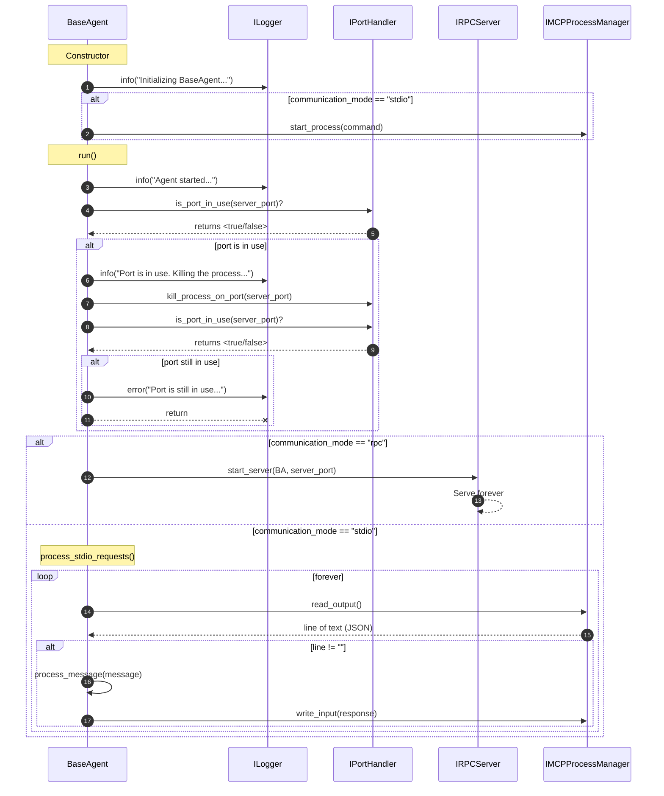

```mermaid
sequenceDiagram
    autonumber
    participant BA as BaseAgent
    participant LG as ILogger
    participant PH as IPortHandler
    participant RPC as IRPCServer
    participant MCP as IMCPProcessManager
    
    note over BA: Constructor
    BA->>LG: info("Initializing BaseAgent...")
    alt communication_mode == "stdio"
        BA->>MCP: start_process(command)
    end

    note over BA: run()
    BA->>LG: info("Agent started...")
    BA->>PH: is_port_in_use(server_port)?
    PH-->>BA: returns <true/false>

    alt port is in use
        BA->>LG: info("Port is in use. Killing the process...")
        BA->>PH: kill_process_on_port(server_port)
        BA->>PH: is_port_in_use(server_port)?
        PH-->>BA: returns <true/false>
        alt port still in use
            BA->>LG: error("Port is still in use...")
            BA--x LG: return
        end
    end

    alt communication_mode == "rpc"
        BA->>RPC: start_server(BA, server_port)
        RPC-->>RPC: Serve forever
    else communication_mode == "stdio"
        note over BA: process_stdio_requests()
        loop forever
            BA->>MCP: read_output()
            MCP-->>BA: line of text (JSON)
            alt line != ""
                BA->>BA: process_message(message)
                BA->>MCP: write_input(response)
            end
        end
    end
```
