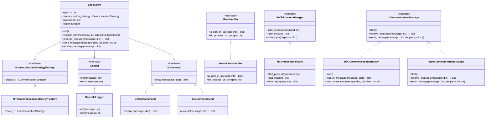

```mermaid
classDiagram
    %% Interfaces
    class ILogger {
        <<interface>>
        +info(message: str)
        +error(message: str)
    }

    class IPortHandler {
        <<interface>>
        +is_port_in_use(port: int): bool
        +kill_process_on_port(port: int)
    }

    class IMCPProcessManager {
        <<interface>>
        +start_process(command: list)
        +read_output(): str
        +write_input(response: dict)
    }

    class ICommunicationStrategy {
        <<interface>>
        +start()
        +receive_message(message: dict): dict
        +send_message(message: dict, recipient_url: str)
    }

    class ICommand {
        <<interface>>
        +execute(message: dict): dict
    }

    class ICommunicationStrategyFactory {
        <<interface>>
        +create(): ICommunicationStrategy
    }

    %% Concrete Implementations
    class ConsoleLogger {
        +info(message: str)
        +error(message: str)
    }

    class DefaultPortHandler {
        +is_port_in_use(port: int): bool
        +kill_process_on_port(port: int)
    }

    class MCPProcessManager {
        +start_process(command: list)
        +read_output(): str
        +write_input(response: dict)
    }

    class RPCCommunicationStrategy {
        +start()
        +receive_message(message: dict): dict
        +send_message(message: dict, recipient_url: str)
    }

    class StdioCommunicationStrategy {
        +start()
        +receive_message(message: dict): dict
        +send_message(message: dict, recipient_url: str)
    }

    class DefaultCommand {
        +execute(message: dict): dict
    }

    class CustomCommand {
        +execute(message: dict): dict
    }

    class RPCCommunicationStrategyFactory {
        +create(): ICommunicationStrategy
    }

    %% Abstract Base Class
    class BaseAgent {
        -agent_id: str
        -communication_strategy: ICommunicationStrategy
        -commands: dict
        -logger: ILogger
        +run()
        +register_command(key: str, command: ICommand)
        +process_message(message: dict): dict
        +send_message(message: dict, recipient_url: str)
        +receive_message(message: dict)
    }

    %% Relationships
    ILogger <|.. ConsoleLogger
    IPortHandler <|.. DefaultPortHandler
    IMCPProcessManager <|.. MCPProcessManager
    ICommunicationStrategy <|.. RPCCommunicationStrategy
    ICommunicationStrategy <|.. StdioCommunicationStrategy
    ICommand <|.. DefaultCommand
    ICommand <|.. CustomCommand
    ICommunicationStrategyFactory <|.. RPCCommunicationStrategyFactory
    BaseAgent --> ICommunicationStrategyFactory
    BaseAgent --> ILogger
    BaseAgent --> ICommand

```