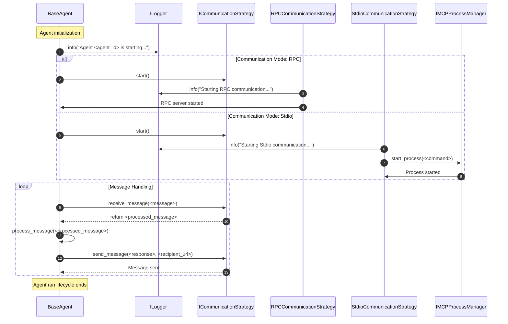

```mermaid
sequenceDiagram
    autonumber
    participant BaseAgent
    participant ILogger
    participant ICommunicationStrategy
    participant RPCCommunicationStrategy
    participant StdioCommunicationStrategy
    participant IMCPProcessManager

    Note over BaseAgent: Agent initialization
    BaseAgent->>ILogger: info("Agent <agent_id> is starting...")

    alt Communication Mode: RPC
        BaseAgent->>ICommunicationStrategy: start()
        RPCCommunicationStrategy->>ILogger: info("Starting RPC communication...")
        RPCCommunicationStrategy->>BaseAgent: RPC server started
    else Communication Mode: Stdio
        BaseAgent->>ICommunicationStrategy: start()
        StdioCommunicationStrategy->>ILogger: info("Starting Stdio communication...")
        StdioCommunicationStrategy->>IMCPProcessManager: start_process(<command>)
        IMCPProcessManager->>StdioCommunicationStrategy: Process started
    end

    loop Message Handling
        BaseAgent->>ICommunicationStrategy: receive_message(<message>)
        ICommunicationStrategy-->>BaseAgent: return <processed_message>
        BaseAgent->>BaseAgent: process_message(<processed_message>)

        BaseAgent->>ICommunicationStrategy: send_message(<response>, <recipient_url>)
        ICommunicationStrategy-->>BaseAgent: Message sent
    end

    Note over BaseAgent: Agent run lifecycle ends
```