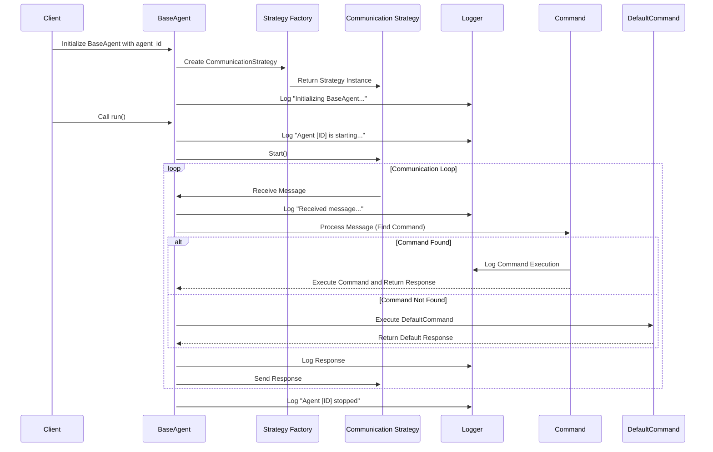

```mermaid
sequenceDiagram
    participant Client as Client
    participant BaseAgent as BaseAgent
    participant StrategyFactory as Strategy Factory
    participant CommunicationStrategy as Communication Strategy
    participant Logger as Logger
    participant Command as Command

    Client->>+BaseAgent: Initialize BaseAgent with agent_id
    BaseAgent->>+StrategyFactory: Create CommunicationStrategy
    StrategyFactory->>+CommunicationStrategy: Return Strategy Instance
    BaseAgent->>Logger: Log "Initializing BaseAgent..."

    Client->>BaseAgent: Call run()
    BaseAgent->>Logger: Log "Agent [ID] is starting..."
    BaseAgent->>CommunicationStrategy: Start()

    loop Communication Loop
        CommunicationStrategy->>BaseAgent: Receive Message
        BaseAgent->>Logger: Log "Received message..."
        BaseAgent->>Command: Process Message (Find Command)
        alt Command Found
            Command->>Logger: Log Command Execution
            Command-->>BaseAgent: Execute Command and Return Response
        else Command Not Found
            BaseAgent->>DefaultCommand: Execute DefaultCommand
            DefaultCommand-->>BaseAgent: Return Default Response
        end
        BaseAgent->>Logger: Log Response
        BaseAgent->>CommunicationStrategy: Send Response
    end

    BaseAgent->>Logger: Log "Agent [ID] stopped"
```