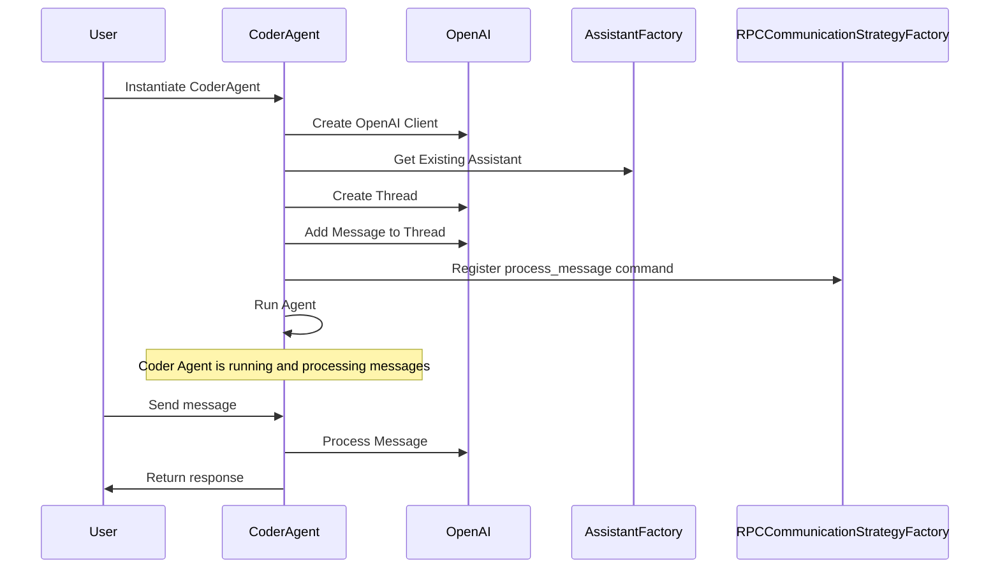

```mermaid
sequenceDiagram
    participant User
    participant CoderAgent
    participant OpenAI
    participant AssistantFactory
    participant RPCCommunicationStrategyFactory

    User->>CoderAgent: Instantiate CoderAgent
    CoderAgent->>OpenAI: Create OpenAI Client
    CoderAgent->>AssistantFactory: Get Existing Assistant
    CoderAgent->>OpenAI: Create Thread
    CoderAgent->>OpenAI: Add Message to Thread
    CoderAgent->>RPCCommunicationStrategyFactory: Register process_message command
    CoderAgent->>CoderAgent: Run Agent
    Note over CoderAgent: Coder Agent is running and processing messages
    User->>CoderAgent: Send message
    CoderAgent->>OpenAI: Process Message
    CoderAgent->>User: Return response
```