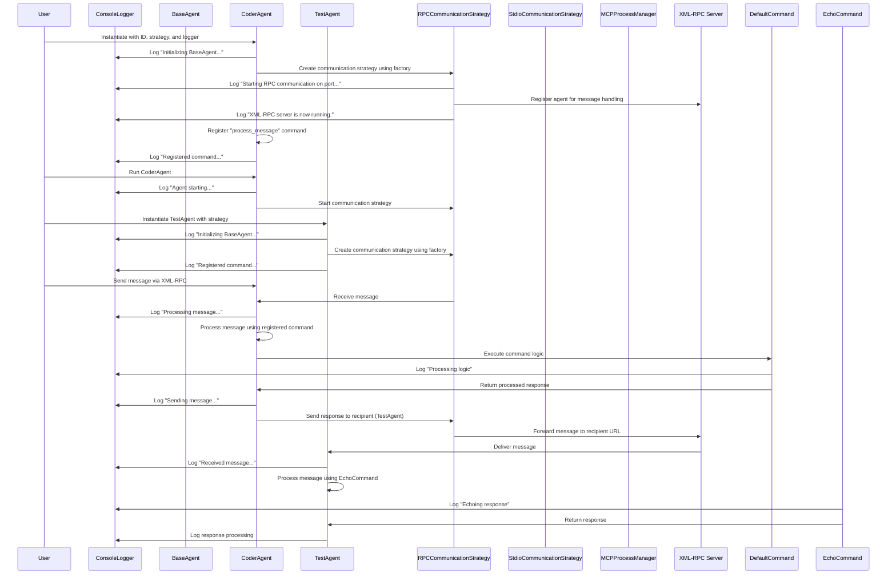

```mermaid
sequenceDiagram
    participant User as User
    participant ConsoleLogger as ConsoleLogger
    participant BaseAgent as BaseAgent
    participant CoderAgent as CoderAgent
    participant TestAgent as TestAgent
    participant RPCCommStrat as RPCCommunicationStrategy
    participant StdioCommStrat as StdioCommunicationStrategy
    participant ProcessManager as MCPProcessManager
    participant XMLRPCServer as XML-RPC Server

    User->>CoderAgent: Instantiate with ID, strategy, and logger
    CoderAgent->>ConsoleLogger: Log "Initializing BaseAgent..."
    CoderAgent->>RPCCommStrat: Create communication strategy using factory
    RPCCommStrat->>ConsoleLogger: Log "Starting RPC communication on port..."
    RPCCommStrat->>XMLRPCServer: Register agent for message handling
    RPCCommStrat->>ConsoleLogger: Log "XML-RPC server is now running."
    CoderAgent->>CoderAgent: Register "process_message" command
    CoderAgent->>ConsoleLogger: Log "Registered command..."

    User->>CoderAgent: Run CoderAgent
    CoderAgent->>ConsoleLogger: Log "Agent starting..."
    CoderAgent->>RPCCommStrat: Start communication strategy

    User->>TestAgent: Instantiate TestAgent with strategy
    TestAgent->>ConsoleLogger: Log "Initializing BaseAgent..."
    TestAgent->>RPCCommStrat: Create communication strategy using factory
    TestAgent->>ConsoleLogger: Log "Registered command..."

    User->>CoderAgent: Send message via XML-RPC
    RPCCommStrat->>CoderAgent: Receive message
    CoderAgent->>ConsoleLogger: Log "Processing message..."
    CoderAgent->>CoderAgent: Process message using registered command
    CoderAgent->>DefaultCommand: Execute command logic
    DefaultCommand->>ConsoleLogger: Log "Processing logic"
    DefaultCommand->>CoderAgent: Return processed response
    CoderAgent->>ConsoleLogger: Log "Sending message..."
    CoderAgent->>RPCCommStrat: Send response to recipient (TestAgent)
    RPCCommStrat->>XMLRPCServer: Forward message to recipient URL
    XMLRPCServer->>TestAgent: Deliver message

    TestAgent->>ConsoleLogger: Log "Received message..."
    TestAgent->>TestAgent: Process message using EchoCommand
    EchoCommand->>ConsoleLogger: Log "Echoing response"
    EchoCommand->>TestAgent: Return response
    TestAgent->>ConsoleLogger: Log response processing
```