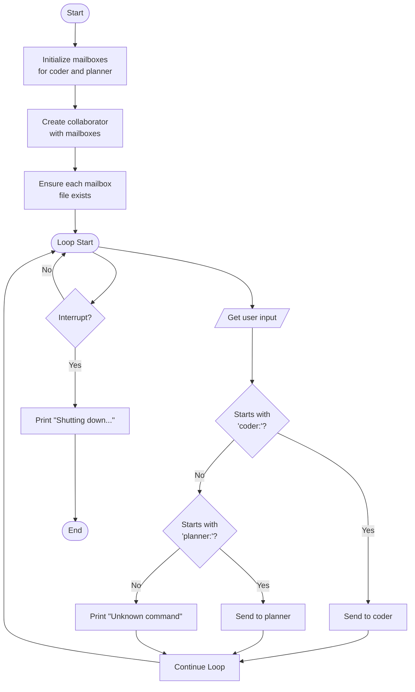

```mermaid
flowchart TD
    Start([Start])
    InitMailboxes[Initialize mailboxes<br>for coder and planner]
    CreateCollaborator[Create collaborator<br>with mailboxes]
    EnsureMailboxes[Ensure each mailbox<br>file exists]
    LoopStart([Loop Start])
    GetInput[/Get user input/]
    CheckCoder{"Starts with<br>'coder:'?"}
    SendCoder[Send to coder]
    CheckPlanner{"Starts with<br>'planner:'?"}
    SendPlanner[Send to planner]
    UnknownCmd[Print &quot;Unknown command&quot;]
    ContinueLoop[Continue Loop]
    Interrupt{Interrupt?}
    Shutdown[Print &quot;Shutting down...&quot;]
    End([End])

    Start --> InitMailboxes
    InitMailboxes --> CreateCollaborator
    CreateCollaborator --> EnsureMailboxes
    EnsureMailboxes --> LoopStart
    LoopStart --> GetInput
    GetInput --> CheckCoder
    CheckCoder -- Yes --> SendCoder
    SendCoder --> ContinueLoop
    CheckCoder -- No --> CheckPlanner
    CheckPlanner -- Yes --> SendPlanner
    SendPlanner --> ContinueLoop
    CheckPlanner -- No --> UnknownCmd
    UnknownCmd --> ContinueLoop
    ContinueLoop --> LoopStart
    LoopStart --> Interrupt
    Interrupt -- Yes --> Shutdown
    Shutdown --> End
    Interrupt -- No --> LoopStart

```
