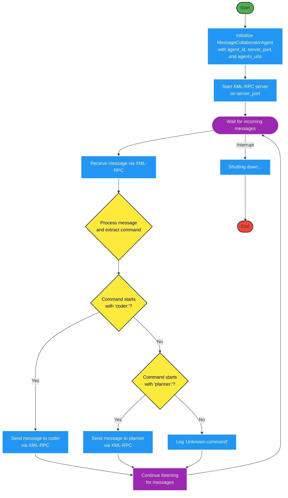

```mermaid
flowchart TD
    Start([Start]):::startNode
    InitAgent[Initialize MessageCollaboratorAgent<br>with agent_id, server_port,<br>and agents_urls]:::process
    StartServer[Start XML-RPC server<br>on server_port]:::process
    WaitForMessages([Wait for incoming messages]):::loop
    ReceiveMessage[Receive message via XML-RPC]:::process
    ProcessMessage{Process message<br>and extract command}:::decision
    CheckCoder{"Command starts<br>with 'coder:'?"}:::decision
    SendToCoder[Send message to coder<br>via XML-RPC]:::process
    CheckPlanner{"Command starts<br>with 'planner:'?"}:::decision
    SendToPlanner[Send message to planner<br>via XML-RPC]:::process
    UnknownCommand[Log 'Unknown command']:::process
    ContinueLoop[Continue listening<br>for messages]:::loop
    Shutdown[Shutting down...]:::process
    EndNode([End]):::endNode

    Start --> InitAgent
    InitAgent --> StartServer
    StartServer --> WaitForMessages
    WaitForMessages --> ReceiveMessage
    ReceiveMessage --> ProcessMessage
    ProcessMessage --> CheckCoder
    CheckCoder -- Yes --> SendToCoder
    SendToCoder --> ContinueLoop
    CheckCoder -- No --> CheckPlanner
    CheckPlanner -- Yes --> SendToPlanner
    SendToPlanner --> ContinueLoop
    CheckPlanner -- No --> UnknownCommand
    UnknownCommand --> ContinueLoop
    ContinueLoop --> WaitForMessages
    WaitForMessages -->|Interrupt| Shutdown
    Shutdown --> EndNode

    %% Class Definitions
    classDef startNode fill:#4CAF50,stroke:#333,stroke-width:2px;
    classDef endNode fill:#F44336,stroke:#333,stroke-width:2px;
    classDef process fill:#2196F3,stroke:#fff,stroke-width:2px, color:#fff;
    classDef decision fill:#FFEB3B,stroke:#333,stroke-width:2px, color:#000;
    classDef loop fill:#9C27B0,stroke:#fff,stroke-width:2px, color:#fff;
```
