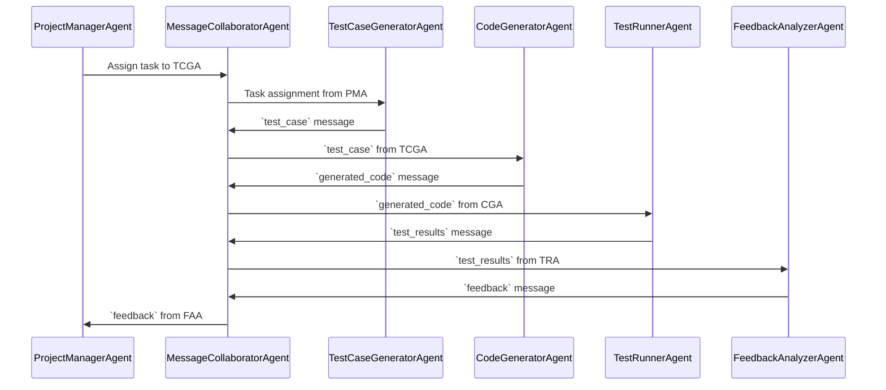

Here is the design and development plan for the Agent-Based Test-Driven Development System.
#
# Design and Development Plan for Agent-Based Test-Driven Development System
#
## Overview

---

## Current System Components

### Built Components

---

## Pending Components

### Agents to Build
1. **CodeGeneratorAgent**
   - Functionality: Interprets test cases and generates code snippets.
   - Status: not started.

2. **MessageCollabratorAgent**
   - Functionality: Routes messages between agents.
   - Status: not started.

3. **TestCaseGeneratorAgent**
   - Functionality: Automatically generates test cases from requirements or specifications.
   - Dependencies: MessageCollaboratorAgent for communication.
   - Status: Not started.

4. **TestRunnerAgent**
   - Functionality: Executes generated code against test cases and reports results.
   - Dependencies: CodeGeneratorAgent, MessageCollaboratorAgent.
   - Status: Not started.

5. **FeedbackAnalyzerAgent**
   - Functionality: Analyzes test results and provides recommendations for improvement.
   - Dependencies: TestRunnerAgent, MessageCollaboratorAgent.
   - Status: Not started.

6. **ProjectManagerAgent**
   - Functionality: oversee the development of the Test-Driven Development (TDD) system, keeping track of what has been built and identifying components that are still under development or pending implementation.Tracks progress, logs completed tasks, and assigns next steps to agents.
   - Dependencies: None (acts as a central authority).
   - Status: In planning.

---

## Tasks for Each Agent

### TestCaseGeneratorAgent
- [ ] Implement logic to generate test cases.
- [ ] Integrate with MessageCollaboratorAgent.
- [ ] Unit test generation logic.

### TestRunnerAgent
- [ ] Implement test execution functionality.
- [ ] Integrate with MessageCollaboratorAgent.
- [ ] Write unit tests for test execution.

### FeedbackAnalyzerAgent
- [ ] Develop analysis methods for test results.
- [ ] Integrate with MessageCollaboratorAgent.
- [ ] Write unit tests for feedback generation.

### ProjectManagerAgent
- [ ] Create tracking and logging functionality.
- [ ] Develop methods to assign tasks to agents.
- [ ] Integrate with MessageCollaboratorAgent for communication.
- [ ] Unit test tracking and task assignment.

---

## System Design Notes

- **Communication:** All agents communicate via the MessageCollaboratorAgent using predefined message types.
- **Unit Testing:** Each agent requires comprehensive unit tests to ensure reliability.
- **Extensibility:** Design each agent with scalability in mind to accommodate future system requirements.

---

## Development Roadmap

1. Build the **TestCaseGeneratorAgent** and verify its integration with the system.
2. Develop the **TestRunnerAgent** and test its compatibility with the CodeGeneratorAgent.
3. Implement the **FeedbackAnalyzerAgent**, ensuring it can process data from the TestRunnerAgent.
4. Create the **ProjectManagerAgent** to oversee and log the system’s development.

---

# Agent Communication Plan

The following table outlines the communication plan for the agents in the system:

  <table style="width: 100%; border-collapse: collapse; font-family: Arial, sans-serif; font-size: 14px;">
    <thead>
      <tr style="color: #fff; background-color: #000; text-align: left;">
        <th style="padding: 10px; border-bottom: 1px solid #000;">Message Type</th>
        <th style="padding: 10px; border-bottom: 1px solid #000;">Sender</th>
        <th style="padding: 10px; border-bottom: 1px solid #000;">Receiver</th>
        <th style="padding: 10px; border-bottom: 1px solid #000;">Description</th>
      </tr>
    </thead>
    <tbody color: #000;>
      <tr style="color: #000; background-color: #ffffff;">
        <td style="padding: 10px; border-bottom: 1px solid #000;">test_case</td>
        <td style="padding: 10px; border-bottom: 1px solid #000;">TestCaseGeneratorAgent</td>
        <td style="padding: 10px; border-bottom: 1px solid #000;">CodeGeneratorAgent</td>
        <td style="padding: 10px; border-bottom: 1px solid #000;">Sends generated test cases.</td>
      </tr>
      <tr style="color: #fff; background-color: #b0b0b0;">
        <td style="padding: 10px; border-bottom: 1px solid #000;">generated_code</td>
        <td style="padding: 10px; border-bottom: 1px solid #000;">CodeGeneratorAgent</td>
        <td style="padding: 10px; border-bottom: 1px solid #000;">TestRunnerAgent</td>
        <td style="padding: 10px; border-bottom: 1px solid #000;">Provides code for testing.</td>
      </tr>
      <tr style="color: #000; background-color: #ffffff;">
        <td style="padding: 10px; border-bottom: 1px solid #000;">test_results</td>
        <td style="padding: 10px; border-bottom: 1px solid #000;">TestRunnerAgent</td>
        <td style="padding: 10px; border-bottom: 1px solid #000;">FeedbackAnalyzerAgent</td>
        <td style="padding: 10px; border-bottom: 1px solid #000;">Sends test execution results.</td>
      </tr>
      <tr style="color: #fff; background-color: #b0b0b0;">
        <td style="padding: 10px; border-bottom: 1px solid #000;">feedback</td>
        <td style="padding: 10px; border-bottom: 1px solid #000;">FeedbackAnalyzerAgent</td>
        <td style="padding: 10px; border-bottom: 1px solid #000;">ProjectManagerAgent</td>
        <td style="padding: 10px; border-bottom: 1px solid #000;">Sends feedback for tracking.</td>
      </tr>
    </tbody>
  </table>

---
---
---

# Agent Communication Sequence Diagram

## Next Steps

1. Begin implementing the **TestCaseGeneratorAgent**.
2. Define detailed message formats for inter-agent communication.
3. Create unit test suites for all agents.

---

Please create the instructions for the Code Generator Agent in this system.  Format the document just like you did with the Message Collaborator Agent.