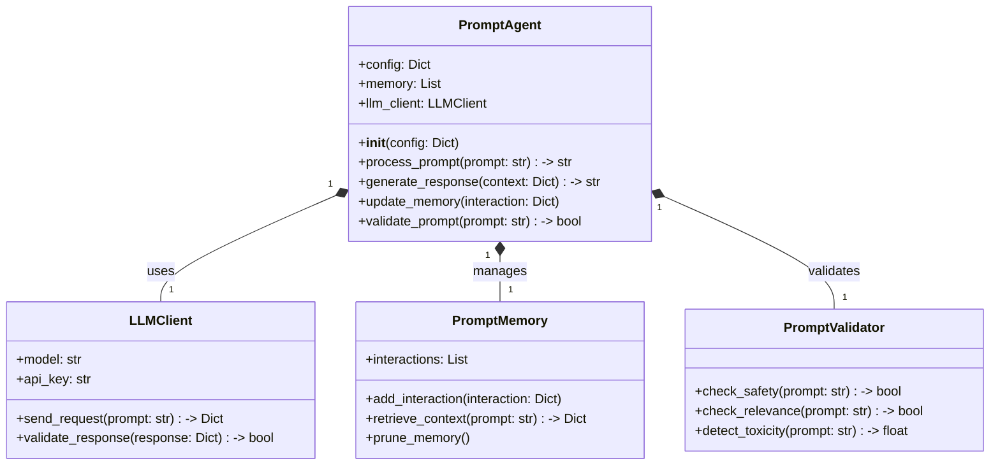

```mermaid
classDiagram
    class PromptAgent {
        +config: Dict
        +memory: List
        +llm_client: LLMClient
        +__init__(config: Dict)
        +process_prompt(prompt: str) -> str
        +generate_response(context: Dict) -> str
        +update_memory(interaction: Dict)
        +validate_prompt(prompt: str) -> bool
    }

    class LLMClient {
        +model: str
        +api_key: str
        +send_request(prompt: str) -> Dict
        +validate_response(response: Dict) -> bool
    }

    class PromptMemory {
        +interactions: List
        +add_interaction(interaction: Dict)
        +retrieve_context(prompt: str) -> Dict
        +prune_memory()
    }

    class PromptValidator {
        +check_safety(prompt: str) -> bool
        +check_relevance(prompt: str) -> bool
        +detect_toxicity(prompt: str) -> float
    }

    PromptAgent "1" *-- "1" LLMClient: uses
    PromptAgent "1" *-- "1" PromptMemory: manages
    PromptAgent "1" *-- "1" PromptValidator: validates
```