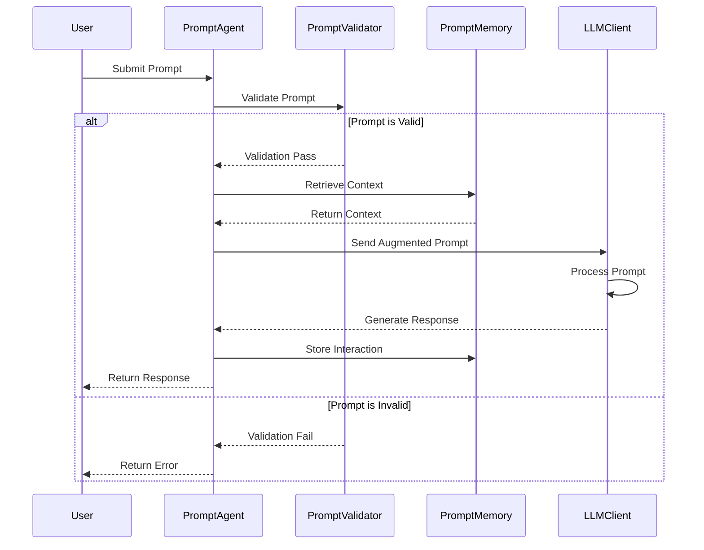

```mermaid
sequenceDiagram
    participant User
    participant PromptAgent
    participant PromptValidator
    participant PromptMemory
    participant LLMClient

    User->>PromptAgent: Submit Prompt
    PromptAgent->>PromptValidator: Validate Prompt
    alt Prompt is Valid
        PromptValidator-->>PromptAgent: Validation Pass
        PromptAgent->>PromptMemory: Retrieve Context
        PromptMemory-->>PromptAgent: Return Context
        PromptAgent->>LLMClient: Send Augmented Prompt
        LLMClient->>LLMClient: Process Prompt
        LLMClient-->>PromptAgent: Generate Response
        PromptAgent->>PromptMemory: Store Interaction
        PromptAgent-->>User: Return Response
    else Prompt is Invalid
        PromptValidator-->>PromptAgent: Validation Fail
        PromptAgent-->>User: Return Error
    end
```