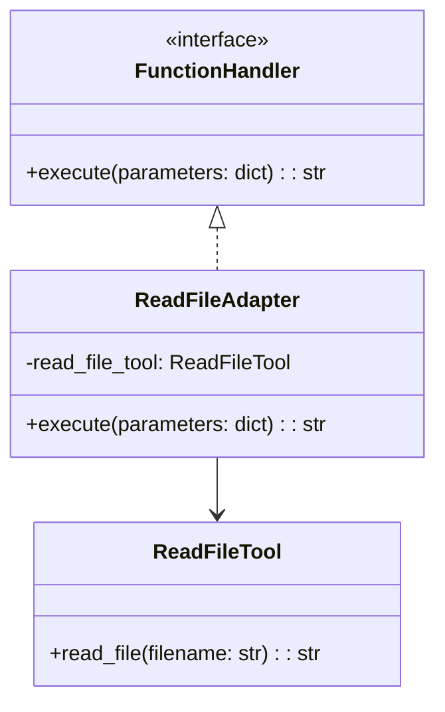

```mermaid
classDiagram
    class FunctionHandler {
        <<interface>>
        +execute(parameters: dict): str
    }
    class ReadFileAdapter {
        -read_file_tool: ReadFileTool
        +execute(parameters: dict): str
    }
    class ReadFileTool {
        +read_file(filename: str): str
    }
    FunctionHandler <|.. ReadFileAdapter
    ReadFileAdapter --> ReadFileTool
```