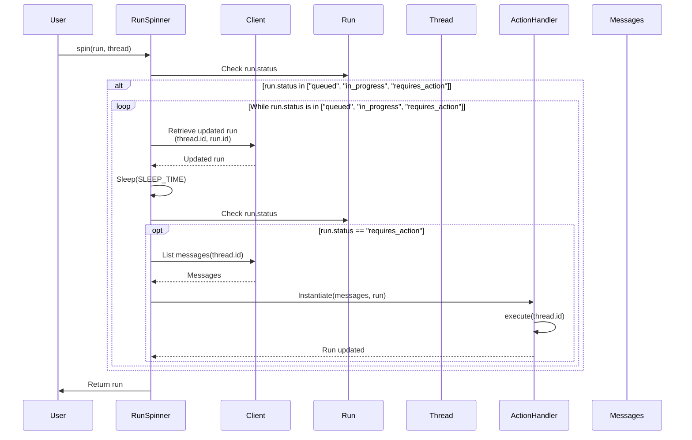

# Mermaid Sequence diagram for RunSpinner

```mermaid
sequenceDiagram
    participant User
    participant RunSpinner
    participant Client
    participant Run
    participant Thread
    participant ActionHandler
    participant Messages

    User->>RunSpinner: spin(run, thread)
    RunSpinner->>Run: Check run.status
    alt run.status in ["queued", "in_progress", "requires_action"]
        loop While run.status is in ["queued", "in_progress", "requires_action"]
            RunSpinner->>Client: Retrieve updated run<br/>(thread.id, run.id)
            Client-->>RunSpinner: Updated run
            RunSpinner->>RunSpinner: Sleep(SLEEP_TIME)
            RunSpinner->>Run: Check run.status
            opt run.status == "requires_action"
                RunSpinner->>Client: List messages(thread.id)
                Client-->>RunSpinner: Messages
                RunSpinner->>ActionHandler: Instantiate(messages, run)
                ActionHandler->>ActionHandler: execute(thread.id)
                ActionHandler-->>RunSpinner: Run updated
            end
        end
    end
    RunSpinner->>User: Return run
```
