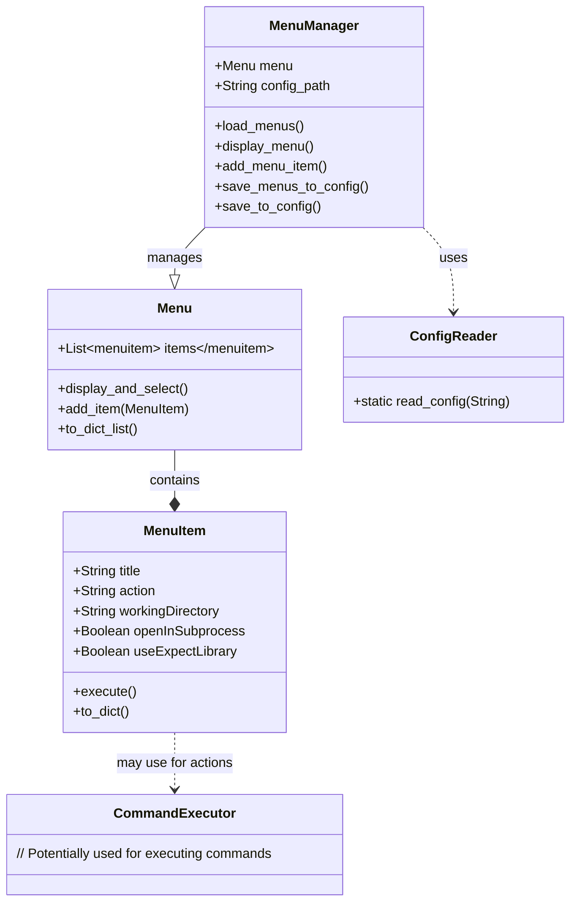

```mermaid
classDiagram
    class Menu {
        +List<MenuItem> items
        +display_and_select()
        +add_item(MenuItem)
        +to_dict_list()
    }
    class MenuItem {
        +String title
        +String action
        +String workingDirectory
        +Boolean openInSubprocess
        +Boolean useExpectLibrary
        +execute()
        +to_dict()
    }
    class MenuManager {
        +Menu menu
        +String config_path
        +load_menus()
        +display_menu()
        +add_menu_item()
        +save_menus_to_config()
        +save_to_config()
    }
    class ConfigReader {
        +static read_config(String)
    }
    class CommandExecutor {
        // Potentially used for executing commands
    }
    MenuManager --|> Menu : manages
    Menu --* MenuItem : contains
    MenuManager ..> ConfigReader : uses
    MenuItem ..> CommandExecutor : may use for actions
```
