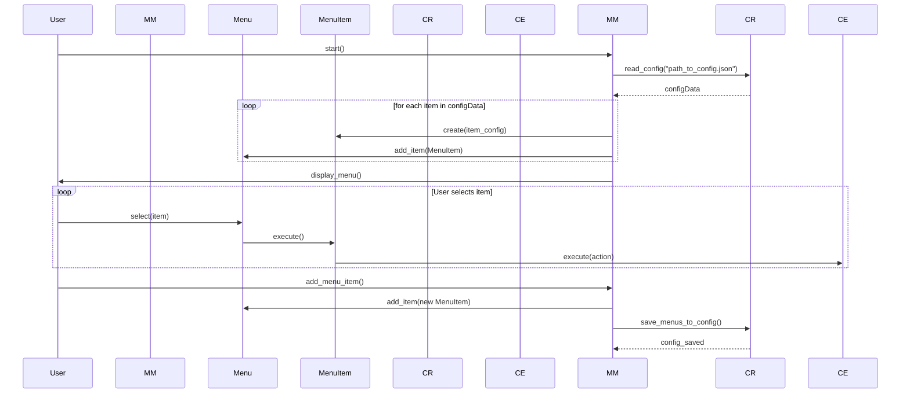

```mermaid
sequenceDiagram
    participant User
    participant MenuManager as MM
    participant Menu
    participant MenuItem
    participant ConfigReader as CR
    participant CommandExecutor as CE
    User->>MM: start()
    MM->>CR: read_config("path_to_config.json")
    CR-->>MM: configData
    loop for each item in configData
        MM->>MenuItem: create(item_config)
        MM->>Menu: add_item(MenuItem)
    end
    MM->>User: display_menu()
    loop User selects item
        User->>Menu: select(item)
        Menu->>MenuItem: execute()
        MenuItem->>CE: execute(action)
    end
    User->>MM: add_menu_item()
    MM->>Menu: add_item(new MenuItem)
    MM->>CR: save_menus_to_config()
    CR-->>MM: config_saved
```
