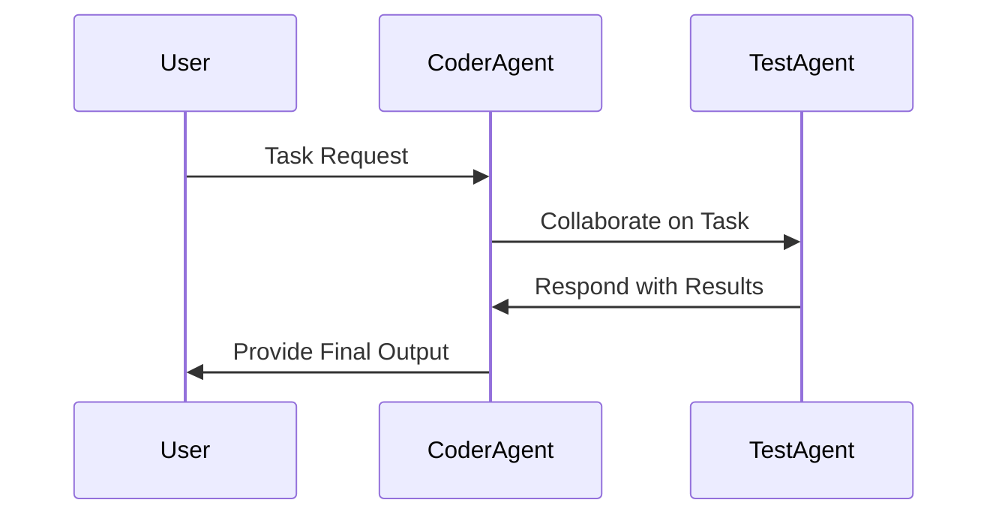
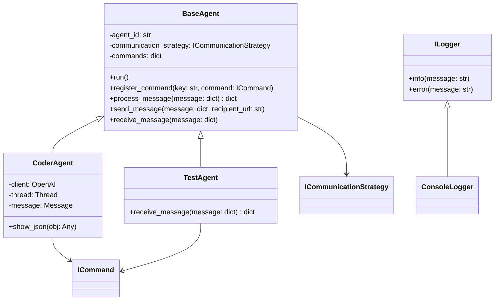

# Agent-Based System Overview

## System Description

This document provides a detailed overview of the agent-based system we have implemented so far. The system consists of modular agents, each designed to perform specific tasks and communicate using XML-RPC over TCP/IP sockets. The architecture ensures scalability, modularity, and ease of integration. This version focuses on the **BaseAgent**, **CoderAgent**, and **TestAgent**. The **PromptAgent** and **MemoryAgent** are planned but not implemented.

---

## Key Components

### 1. Base Agent
The **BaseAgent** class serves as the foundation for all agents in the system. It provides:
- An extensible structure for custom agents.
- XML-RPC communication strategy for inter-agent messaging.
- A logging system to track agent activities.
- A command registration system for processing specific message types.

**Key Features**:
- Communication via the `ICommunicationStrategy` interface.
- Modular logging using the `ILogger` interface (e.g., `ConsoleLogger`).
- Command processing through `register_command` and `process_message`.
- Designed for extensibility, enabling easy integration of custom agents.

---

### 2. Coder Agent
The **CoderAgent** is a specialized implementation of `BaseAgent` designed to assist with AI-driven coding tasks. It integrates with OpenAI for generating modular, testable code.

**Key Features**:
- Integrates with OpenAI for code generation.
- Uses `ProcessMessageCommand` to process incoming messages.
- Communicates with other agents using the XML-RPC strategy.
- Contains helper methods for debugging and JSON processing.

---

### 3. Test Agent
The **TestAgent** is another implementation of `BaseAgent` designed for testing the communication and command-processing features of the system. 

**Key Features**:
- Implements a simple `EchoCommand` for message testing.
- Serves as a prototype for testing inter-agent communication.
- Uses `RPCCommunicationStrategy` for XML-RPC-based messaging.

---

### 4. Communication Strategies
The system supports multiple communication strategies, enabling flexibility in how agents communicate:

1. **RPCCommunicationStrategy**:
   - Uses XML-RPC over TCP/IP for messaging.
   - Registers agent methods with the XML-RPC server.
   - Handles message exchange with other agents via XML-RPC client proxies.

2. **StdioCommunicationStrategy**:
   - Communicates using standard input/output.
   - Reads and writes messages in JSON format.
   - Suitable for command-line or subprocess interactions.

---

## System Architecture Diagram

### Sequence Diagram



### Class Diagram



---

## Configuration Details

### Ports
- **CoderAgent**: Configurable in the code.
- **TestAgent**: Configurable in the code.

### File Structure
```
/agents
    /base_agent
        base_agent.py
    /coder_agent
        coder_agent.py
    /test_agent
        test_agent.py
    /communication
        communication_strategy.py
/tmp
    /logs
```

### Dependencies
- Python 3.8+
- OpenAI SDK
- XML-RPC library
- `psutil` for process management
- `subprocess` for process handling

---

## Next Steps

1. **Prompt Agent Development**:
   - Design and implement the **PromptAgent** for OpenAI-powered conversational tasks.
   - Integrate with the existing communication framework.

2. **Memory Agent Development**:
   - Implement the **MemoryAgent** for long-term storage and retrieval.
   - Use a lightweight database for persistence (e.g., SQLite or ChromaDB).

3. **Integration Testing**:
   - Verify seamless communication between **CoderAgent** and **TestAgent**.
   - Test the system under high loads and for edge cases.

4. **Enhancements**:
   - Add more commands to the **CoderAgent** and **TestAgent**.
   - Improve error handling and logging in the communication strategies.

---
