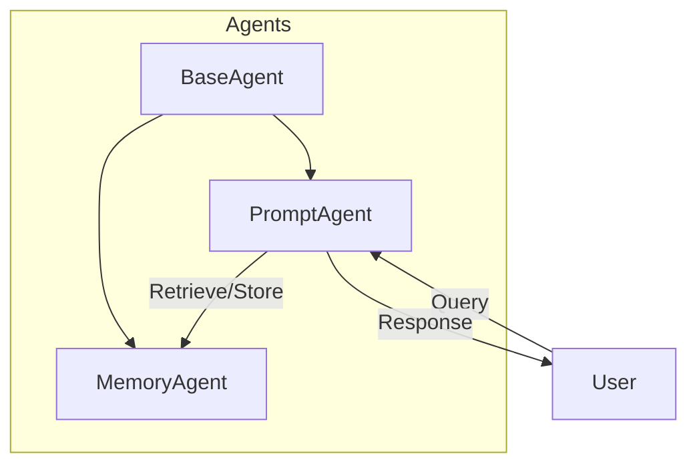

# Agent-Based System Overview

## System Description

This document provides a detailed overview of the agent-based system we have implemented so far. The system consists of modular agents, each designed to perform specific tasks and communicate using XML-RPC over TCP/IP sockets. The architecture ensures scalability, modularity, and ease of integration.

---

## Key Components

### 1. Base Agent
The **BaseAgent** class is the foundation for all agents in the system. It provides:
- XML-RPC server setup for communication.
- A logging system to track agent activities.
- Abstract methods that child agents implement for custom functionality.

**Key Features**:
- TCP/IP communication via `ThreadingXMLRPCServer`.
- Logging using the `Logger` class.
- Methods for sending and receiving messages.

### 2. Prompt Agent
The **PromptAgent** class interacts with OpenAI's GPT models to process and respond to messages. It is responsible for:
- Handling tool invocations and responses.
- Managing a message history for conversational context.
- Interacting with other agents via XML-RPC.

**Key Features**:
- Uses OpenAI's GPT-3.5-turbo for natural language processing.
- Integrated tool management for executing specific functions.
- Listens on port **8004**.

### 3. Memory Agent
The **MemoryAgent** provides long-term memory storage and retrieval capabilities for the system. It uses ChromaDB to store and query task-related memories.
- Stores input-output pairs for later retrieval.
- Allows retrieval of relevant data based on semantic similarity.
- Communicates via XML-RPC.

**Key Features**:
- Memory persistence using ChromaDB.
- Supports storing task-related data with embeddings.
- Listens on port **8005**.

---

## Agent Communication

The agents communicate using XML-RPC over TCP/IP. Each agent is identified by its unique `agent_id` and listens on a specific port. Messages are exchanged in JSON format.

### Example Workflow:
1. **PromptAgent** receives a user query and processes it using OpenAI GPT.
2. If required, **PromptAgent** sends a message to **MemoryAgent** for retrieving or storing information.
3. **MemoryAgent** processes the request and returns results.
4. **PromptAgent** continues processing or provides a final response.

---

## System Architecture Diagram



---

## Configuration Details

### Ports
- **PromptAgent**: 8004
- **MemoryAgent**: 8005

### File Structure
```
/agents
    /base_agent
        base_agent.py
    /prompt_agent
        prompt_agent.py
    /memory_agent
        memory_agent.py
/tmp
    /memory_agent_db
```

### Dependencies
- Python 3.8+
- ChromaDB
- OpenAI SDK
- XML-RPC library

---

## Next Steps

1. **Integration Testing**:
   - Verify seamless communication between **PromptAgent** and **MemoryAgent**.
   - Test for edge cases and large memory queries.

2. **Feature Expansion**:
   - Add more agents for specific tasks (e.g., a Planner Agent or Coder Agent).
   - Enhance the memory retrieval algorithm.

3. **Documentation**:
   - Expand on API details and usage instructions.
   - Provide sample configuration files.

4. **Review and Feedback**:
   - Gather feedback from the design team for improvements.
   - Plan additional capabilities based on user requirements.

---

## Contact

For further questions or suggestions, please reach out to the development team.

---
