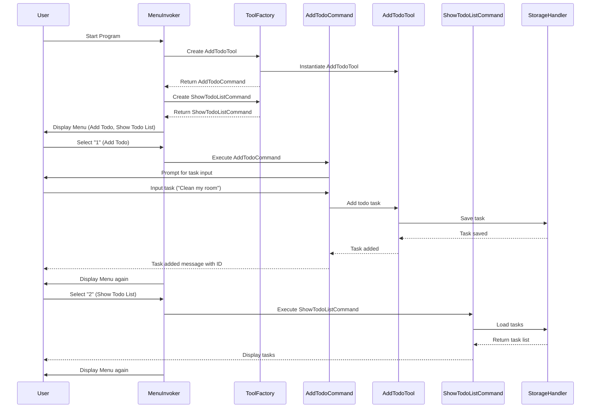

#
# Python Todo Command Menu
# 
# 09-29-2024

https://chatgpt.com/share/66f99882-abe4-8006-a9bc-05e7a8e42662

# Mermaid Sequence Diagram

```mermaid
sequenceDiagram
    participant User
    participant MenuInvoker
    participant ToolFactory
    participant AddTodoCommand
    participant AddTodoTool
    participant ShowTodoListCommand
    participant StorageHandler

    User->>MenuInvoker: Start Program
    MenuInvoker->>ToolFactory: Create AddTodoTool
    ToolFactory->>AddTodoTool: Instantiate AddTodoTool
    ToolFactory-->>MenuInvoker: Return AddTodoCommand
    MenuInvoker->>ToolFactory: Create ShowTodoListCommand
    ToolFactory-->>MenuInvoker: Return ShowTodoListCommand

    MenuInvoker->>User: Display Menu (Add Todo, Show Todo List)

    User->>MenuInvoker: Select "1" (Add Todo)
    MenuInvoker->>AddTodoCommand: Execute AddTodoCommand
    AddTodoCommand->>User: Prompt for task input
    User->>AddTodoCommand: Input task ("Clean my room")
    AddTodoCommand->>AddTodoTool: Add todo task
    AddTodoTool->>StorageHandler: Save task
    StorageHandler-->>AddTodoTool: Task saved
    AddTodoTool-->>AddTodoCommand: Task added
    AddTodoCommand-->>User: Task added message with ID

    MenuInvoker->>User: Display Menu again

    User->>MenuInvoker: Select "2" (Show Todo List)
    MenuInvoker->>ShowTodoListCommand: Execute ShowTodoListCommand
    ShowTodoListCommand->>StorageHandler: Load tasks
    StorageHandler-->>ShowTodoListCommand: Return task list
    ShowTodoListCommand-->>User: Display tasks
    MenuInvoker->>User: Display Menu again

```