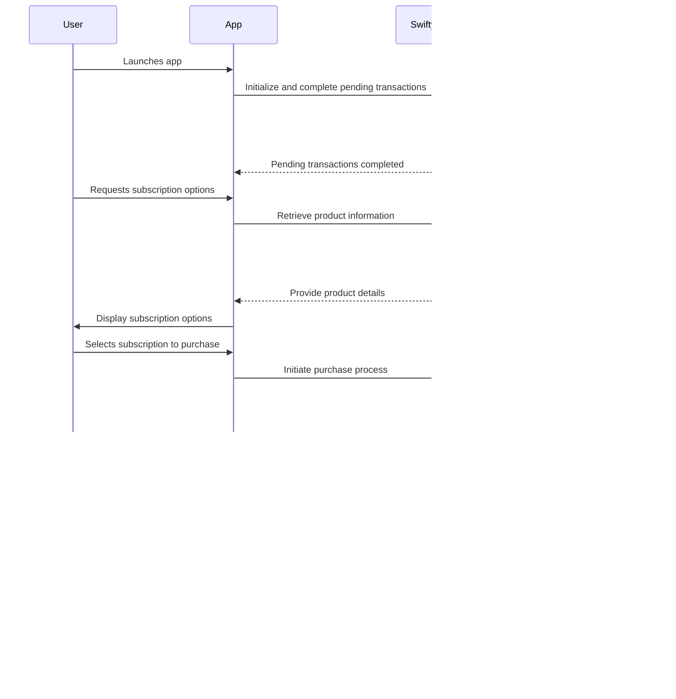

# SwiftyStoreKit Sequence Diagram

```mermaid
sequenceDiagram
    participant User
    participant App
    participant SwiftyStoreKit
    participant App Store

    User->>App: Launches app
    App->>SwiftyStoreKit: Initialize and complete pending transactions
    SwiftyStoreKit->>App Store: Complete pending transactions
    App Store-->>SwiftyStoreKit: Confirmation
    SwiftyStoreKit-->>App: Pending transactions completed

    User->>App: Requests subscription options
    App->>SwiftyStoreKit: Retrieve product information
    SwiftyStoreKit->>App Store: Request product details
    App Store-->>SwiftyStoreKit: Return product details
    SwiftyStoreKit-->>App: Provide product details
    App->>User: Display subscription options

    User->>App: Selects subscription to purchase
    App->>SwiftyStoreKit: Initiate purchase process
    SwiftyStoreKit->>App Store: Process payment
    App Store-->>SwiftyStoreKit: Confirm purchase
    SwiftyStoreKit-->>App: Purchase successful
    App->>User: Unlock subscription content

    User->>App: Requests to restore purchases
    App->>SwiftyStoreKit: Restore purchases
    SwiftyStoreKit->>App Store: Retrieve purchase history
    App Store-->>SwiftyStoreKit: Return purchase history
    SwiftyStoreKit-->>App: Provide restored purchases
    App->>User: Restore subscription content

```
