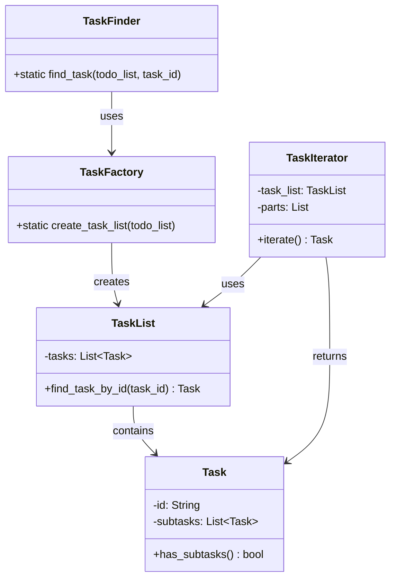

```mermaid
classDiagram
    class TaskFinder {
        +static find_task(todo_list, task_id)
    }

    class TaskFactory {
        +static create_task_list(todo_list)
    }

    class TaskIterator {
        -task_list: TaskList
        -parts: List
        +iterate() Task
    }

    class TaskList {
        -tasks: List~Task~
        +find_task_by_id(task_id) Task
    }

    class Task {
        -id: String
        -subtasks: List~Task~
        +has_subtasks() bool
    }

    TaskFinder --> TaskFactory : uses
    TaskFactory --> TaskList : creates
    TaskIterator --> TaskList : uses
    TaskList --> Task : contains
    TaskIterator --> Task : returns

```