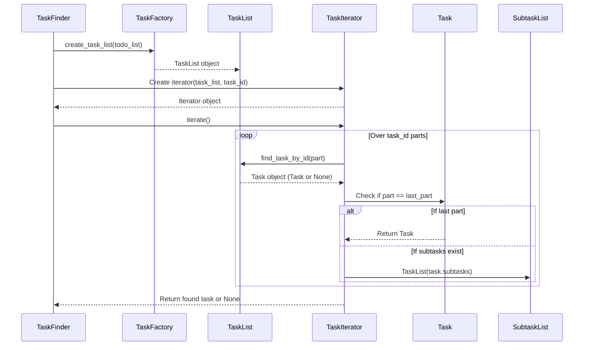

# Sequence diagram for TaskFinder

```mermaid
sequenceDiagram
    participant TaskFinder
    participant TaskFactory
    participant TaskList
    participant TaskIterator
    participant Task
    participant SubtaskList

    TaskFinder->>TaskFactory: create_task_list(todo_list)
    TaskFactory-->>TaskList: TaskList object
    
    TaskFinder->>TaskIterator: Create iterator(task_list, task_id)
    TaskIterator-->>TaskFinder: Iterator object

    TaskFinder->>TaskIterator: iterate()
    
    loop Over task_id parts
        TaskIterator->>TaskList: find_task_by_id(part)
        TaskList-->>TaskIterator: Task object (Task or None)
        TaskIterator->>Task: Check if part == last_part
        alt If last part
            Task-->>TaskIterator: Return Task
        else If subtasks exist
            TaskIterator->>SubtaskList: TaskList(task.subtasks)
        end
    end

    TaskIterator-->>TaskFinder: Return found task or None
```
